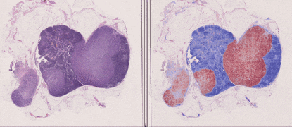
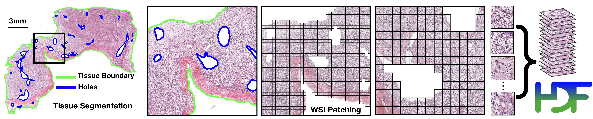

CLAM 
===========
전체 슬라이드 이미지에서 데이터 효율적이고 약한 감독 학습 기반 계산 병리학
*Nature Biomedical Engineering*

[ArXiv](https://arxiv.org/abs/2004.09666) | [Journal Link](https://www.nature.com/articles/s41551-020-00682-w) | [Interactive Demo](http://clam.mahmoodlab.org) | [인용](#reference) 

***요약:** CLAM은 ROI 추출이나 패치 수준 주석 없이 슬라이드 수준 레이블을 사용하여 데이터 효율적인 전체 슬라이드 이미지(WSI) 분류를 위한 고처리량 및 해석 가능한 방법이며, 다중 클래스 아형 분류 문제를 처리할 수 있습니다. 세 가지 서로 다른 WSI 데이터셋에서 테스트되었으며, 훈련된 모델은 WSI 절제 및 생검의 독립적인 테스트 코호트뿐만 아니라 스마트폰 현미경 이미지(현미경 사진)에도 적응합니다.*

[](http://clam.mahmoodlab.org)
## CLAM: 데이터 효율적이고 약한 감독 학습 기반 전체 슬라이드 수준 분석을 위한 딥러닝 파이프라인
[사전 요구사항](#사전-요구사항) • [설치](docs/INSTALLATION.md) • [분할 및 패칭](#wsi-분할-및-패칭) • [특성 추출](#clam을-사용한-슬라이드-수준-레이블의-약한-감독-학습) • [약한 감독 학습 훈련](#훈련-분할) • [테스트](#테스트-및-평가-스크립트) • [훈련된 모델](#훈련된-모델-체크포인트) • [히트맵 시각화](#히트맵-시각화) • [예제](#예제) • [Pre-print](https://arxiv.org/abs/2004.09666) • [Demo](http://clam.mahmoodlab.org) • [인용](#reference)

***CLAM은 어떻게 작동하나요?** 클러스터링 제약 어텐션 다중 인스턴스 학습(CLAM)은 어텐션 기반 학습을 사용하여 전체 슬라이드를 정확하게 분류하기 위해 높은 진단 가치를 가진 하위 영역을 자동으로 식별하는 동시에, 식별된 대표 영역에 대한 인스턴스 수준 클러스터링을 활용하여 특성 공간을 제약하고 정제하는 딥러닝 기반 약한 감독 학습 방법입니다.*

© [Mahmood Lab](http://www.mahmoodlab.org) - 이 코드는 GPLv3 라이선스 하에 제공되며 비상업적 학술 목적으로 사용 가능합니다. 

## 업데이트:
* **2025년 4월 15일**: 25개 이상의 파운데이션 모델을 지원하는 전체 슬라이드 이미지 처리를 위한 새로운 저장소 [Trident](https://github.com/mahmoodlab/TRIDENT)를 확인하세요. [UNIv2](https://huggingface.co/MahmoodLab/UNI2-h), [CONCH](https://huggingface.co/MahmoodLab/CONCH), [TITAN](https://huggingface.co/MahmoodLab/TITAN) 등을 포함합니다!
* **2024년 4월 6일**: [UNI](https://github.com/mahmoodlab/UNI)와 [CONCH](https://github.com/mahmoodlab/CONCH)를 사전 훈련된 인코더로 선택할 수 있습니다. 자세한 내용은 [CONCH / UNI를 사전 훈련된 인코더로 사용](#conch--uni를-사전-훈련된-인코더로-사용)을 참조하세요. 최신 **env.yml** 파일을 설치하여(자세한 내용은 [설치 가이드](docs/INSTALLATION.md) 참조) 모든 종속성이 올바르게 설치되었는지 확인하고 해당 **clam_latest** conda 환경을 사용하세요.
* 2024년 3월 19일: 조직병리학 이미지에 대한 강력한 표현을 생성하고 MIL 기반 CLAM 워크플로우를 포함한 다양한 계산 병리학 워크플로우의 성능을 향상시키는 SOTA 사전 훈련된 인코더 쌍인 [UNI](https://github.com/mahmoodlab/UNI)와 [CONCH](https://github.com/mahmoodlab/CONCH)를 출시했습니다. 
* 2021년 5월 24일: **create_heatmaps.py**를 통해 히트맵 시각화 스크립트가 제공됩니다. 구성 템플릿은 **heatmaps/configs**에 있습니다. 자세한 내용은 [히트맵 시각화](#히트맵-시각화)를 참조하세요.
* 2021년 3월 1일: 새로운 고속 패칭/특성 추출 파이프라인이 제공됩니다. **요약:** CLAM은 훈련에 이미지 특성만 필요하므로 실제 이미지 패치를 저장할 필요가 없습니다. 새로운 파이프라인은 이 오버헤드를 제거하고 대신 "패칭" 중에 이미지 패치의 좌표만 저장하고 특성 추출 중에 WSI에서 이러한 영역을 즉시 로드합니다. 이는 이전 파이프라인보다 훨씬 빠르며 일반적으로 "패칭"에 1-2초, WSI 특성화에 몇 분 정도 걸립니다. 새로운 파이프라인을 사용하려면 이전 **create_patches.py** 및 **extract_features.py** 스크립트 대신 **create_patches_fp.py** 및 **extract_features_fp.py**를 호출하는지 확인하세요.

**참고**: 최신 업데이트가 사용자의 워크플로우에 최소한의 변경만 필요하기를 바라지만, 필요한 경우 [여기](https://github.com/mahmoodlab/CLAM/tree/deprecated)에서 코드베이스의 이전 버전을 참조할 수 있습니다. 문제가 있으면 공개 포럼에 보고해 주세요. 

**경고**: 최신 업데이트는 기본적으로 사전 훈련된 인코더를 사용하여 특성을 추출하기 전에 이미지 패치를 224 x 224로 크기 조정합니다. 이 변경은 UNI, CONCH 및 기타 연구에서 사용된 평가 프로토콜과 더 일관되게 만들기 위한 것입니다. 패칭 중에 생성된 이미지 패치의 원래 크기를 보존하거나 특성 추출에 다른 이미지 크기를 사용하려는 경우 **extract_features_fp.py**에서 `--target_patch_size`를 지정하여 수행할 수 있습니다.

**2021년 3월 1일 업데이트**: README가 기본적으로 새로운 더 빠른 파이프라인을 사용하도록 업데이트되었습니다. 여전히 이전 파이프라인을 사용하려면 [이전 파이프라인 가이드](docs/README_old.md)를 참조하세요. 조직 패치를 저장하므로 훨씬 느리고 많은 저장 공간을 차지하지만 특성 임베딩 대신 원본 이미지 패치로 작업해야 하는 경우 여전히 유용할 수 있습니다.

## 설치:
시작하는 방법에 대한 자세한 지침은 [설치 가이드](docs/INSTALLATION.md)를 참조하세요.

## WSI 분할 및 패칭 


첫 번째 단계는 조직을 분할하고 모든 구멍을 제외하는 데 중점을 둡니다. 특정 슬라이드의 분할은 개별 매개변수를 조정하여 조정할 수 있습니다(예: 구멍으로 나타나는 확장된 혈관은 특정 육종에 중요할 수 있습니다.) 
다음 예제는 잘 알려진 표준 형식(.svs, .ndpi, .tiff 등)의 디지털화된 전체 슬라이드 이미지 데이터가 DATA_DIRECTORY라는 폴더 아래에 저장되어 있다고 가정합니다.

```bash
DATA_DIRECTORY/
	├── slide_1.svs
	├── slide_2.svs
	└── ...
```

### 기본, 완전 자동 실행
``` shell
python create_patches_fp.py --source DATA_DIRECTORY --save_dir RESULTS_DIRECTORY --patch_size 256 --seg --patch --stitch 
```

위 명령은 기본 매개변수를 사용하여 DATA_DIRECTORY의 모든 슬라이드를 분할하고, 분할된 조직 영역 내의 모든 패치를 추출하며, 추출된 패치를 사용하여 각 슬라이드에 대한 스티치 재구성을 생성하고(선택 사항) 지정된 RESULTS_DIRECTORY에 다음 폴더 구조를 생성합니다:

```bash
RESULTS_DIRECTORY/
	├── masks
    		├── slide_1.png
    		├── slide_2.png
    		└── ...
	├── patches
    		├── slide_1.h5
    		├── slide_2.h5
    		└── ...
	├── stitches
    		├── slide_1.png
    		├── slide_2.png
    		└── ...
	└── process_list_autogen.csv
```

**masks** 폴더는 분할 결과를 포함합니다(슬라이드당 하나의 이미지).
**patches** 폴더는 각 슬라이드에서 추출된 조직 패치 배열을 포함합니다(슬라이드당 하나의 .h5 파일, 각 항목은 패치의 왼쪽 상단 모서리 좌표에 해당)
**stitches** 폴더는 스티치된 조직 패치의 다운샘플된 시각화를 포함합니다(슬라이드당 하나의 이미지)(선택 사항, 다운스트림 작업에 사용되지 않음)
자동 생성된 csv 파일 **process_list_autogen.csv**는 처리된 모든 슬라이드 목록과 사용된 분할/패칭 매개변수를 포함합니다.

추가로 전달할 수 있는 플래그는 다음과 같습니다:
* `--custom_downsample`: 사용자 정의 다운스케일 인수(권장하지 않음, 이상적으로는 먼저 네이티브 다운샘플이 있는지 확인해야 함)
* `--patch_level`: 패치를 추출할 다운샘플 피라미드 레벨(기본값은 0, 사용 가능한 최고 해상도)
* `--no_auto_skip`: 기본적으로 스크립트는 대상 폴더에 이미 패치된 .h5 파일이 있는 파일을 건너뜁니다. 이 토글을 사용하여 이 동작을 재정의할 수 있습니다.

일부 매개변수 템플릿도 사용할 수 있으며 기본 매개변수에 대한 좋은 선택으로 쉽게 배포할 수 있습니다:
* `bwh_biopsy.csv`: BWH에서 스캔한 생검 슬라이드 분할에 사용(Hamamatsu S210 및 Aperio GT450로 스캔)
* `bwh_resection.csv`: BWH에서 스캔한 절제 슬라이드 분할에 사용
* `tcga.csv`: TCGA 슬라이드 분할에 사용

템플릿 파일 이름을 --preset 인수에 전달하기만 하면 됩니다. 예를 들어 생검 템플릿을 사용하려면:
``` shell
python create_patches_fp.py --source DATA_DIRECTORY --save_dir RESULTS_DIRECTORY --patch_size 256 --preset bwh_biopsy.csv --seg --patch --stitch
```
### 사용자 정의 기본 분할 매개변수
고급 사용을 위해 스크립트 **create_patches_fp.py**에 정의된 기본 단일 매개변수 집합을 사용하는 것 외에도 사용자는 데이터셋에 따라 사용자 정의 매개변수 템플릿을 정의할 수 있습니다. 이러한 템플릿은 **presets** 아래에 저장되어야 하며 분할 및 패칭 중에 사용되는 각 매개변수에 대한 값을 포함합니다. 

분할 매개변수 목록은 다음과 같습니다:
* `seg_level`: WSI를 분할할 다운샘플 레벨(기본값: -1, 64x 다운샘플에 가장 가까운 WSI의 다운샘플 사용)
* `sthresh`: 분할 임계값(양의 정수, 기본값: 8, 더 높은 임계값을 사용하면 전경이 줄고 배경 감지가 증가함)
* `mthresh`: 중앙값 필터 크기(양의 홀수 정수, 기본값: 7)
* `use_otsu`: 간단한 이진 임계값 대신 otsu 방법 사용(기본값: False) 
* `close`: 초기 임계값 적용 후 적용할 추가 형태학적 닫기(양의 정수 또는 -1, 기본값: 4)

윤곽 필터링 매개변수 목록은 다음과 같습니다:
* `a_t`: 조직에 대한 영역 필터 임계값(양의 정수, 고려할 감지된 전경 윤곽의 최소 크기, 레벨 0에서 512 x 512 패치 크기 기준, 예: 값 10은 레벨 0에서 10개의 512 x 512 크기 패치보다 큰 감지된 전경 윤곽만 처리됨을 의미, 기본값: 100)
* `a_h`: 구멍에 대한 영역 필터 임계값(양의 정수, 전경 윤곽에서 피할 감지된 구멍/공동의 최소 크기, 다시 레벨 0에서 512 x 512 크기 패치 기준, 기본값: 16)
* `max_n_holes`: 감지된 전경 윤곽당 고려할 최대 구멍 수(양의 정수, 기본값: 10, 더 높은 최대값은 더 정확한 패칭을 이끌지만 계산 비용을 증가시킴)

분할 시각화 매개변수 목록은 다음과 같습니다:
* `vis_level`: 분할 결과를 시각화할 다운샘플 레벨(기본값: -1, 64x 다운샘플에 가장 가까운 WSI의 다운샘플 사용)
* `line_thickness`: 분할 결과를 시각화하기 위해 그릴 선 두께(양의 정수, 레벨 0에서 그려진 선이 차지하는 픽셀 수 기준, 기본값: 250)

패칭 매개변수 목록은 다음과 같습니다:
* `use_padding`: 슬라이드 테두리를 패딩할지 여부(기본값: True)
* `contour_fn`: 패치를 전경 또는 배경으로 간주할지 결정하는 윤곽 확인 함수('four_pt' - 패치 중심 주변의 작은 그리드에서 네 점이 모두 윤곽 내부에 있는지 확인, 'center' - 패치 중심이 윤곽 내부에 있는지 확인, 'basic' - 패치의 왼쪽 상단 모서리가 윤곽 내부에 있는지 확인, 기본값: 'four_pt')


### 두 단계 실행 (특정 슬라이드에 대한 매개변수 수동 조정)
고품질 분할 및 관련 조직 패치 추출을 보장하기 위해 사용자는 먼저 분할을 수행하고(일반적으로 슬라이드당 약 1초), 분할 결과를 검사하고 필요한 경우 선택한 슬라이드에 대한 매개변수를 조정한 다음 조정된 매개변수를 사용하여 패치를 추출하는 옵션이 있습니다. 즉, 먼저 실행:

``` shell
python create_patches_fp.py --source DATA_DIRECTORY --save_dir RESULTS_DIRECTORY --patch_size 256 --seg  
```
위 명령은 기본 매개변수를 사용하여 DATA_DIRECTORY의 모든 슬라이드를 분할하고 csv 파일을 생성하지만 아직 패칭하지는 않습니다(**patches** 및 **stitches** 폴더는 비어 있음)

csv 파일은 특정 슬라이드에 대해 조정할 수 있으며 --process_list CSV_FILE_NAME을 통해 스크립트에 전달되어 스크립트가 사용자가 업데이트한 사양을 사용하도록 할 수 있습니다. 분할 매개변수를 조정하기 전에 사용자는 csv 파일의 복사본을 만들고 새 이름(예: process_list_edited.csv)을 지정해야 합니다. 그렇지 않으면 이 기본 이름을 가진 파일이 다음에 명령을 실행할 때 덮어씌워집니다. 그런 다음 사용자는 csv 파일에서 해당 필드를 변경하여 특정 슬라이드에 대한 매개변수를 조정하는 옵션이 있습니다. **process** 열은 스크립트가 특정 슬라이드를 처리해야 하는지 여부에 대한 이진 변수(0 또는 1)를 저장합니다. 이를 통해 사용자는 선택한 몇 개의 슬라이드만 토글하여 조정된 매개변수가 만족스러운 결과를 생성하는지 빠르게 확인할 수 있습니다. 예를 들어 사용자가 업데이트한 매개변수를 사용하여 slide_1.svs만 다시 분할하려면 해당 필드를 적절히 변경하고, **process** 셀을 1로 업데이트하고, csv 파일을 저장하고, 위와 동일한 명령에 이름을 전달합니다:

``` shell
python create_patches_fp.py --source DATA_DIRECTORY --save_dir RESULTS_DIRECTORY --patch_size 256 --seg --process_list process_list_edited.csv
```

분할 결과에 만족하면 사용자는 처리해야 하는 모든 슬라이드에 대해 **process** 셀을 1로 만들고, csv 파일을 저장하고, 저장된 csv 파일로 패칭을 실행해야 합니다(완전 자동 실행 사용 사례와 마찬가지로 추가 csv 파일 인수 포함):

``` shell
python create_patches_fp.py --source DATA_DIRECTORY --save_dir RESULTS_DIRECTORY --patch_size 256 --seg --process_list CSV_FILE_NAME --patch --stitch
```
## CLAM을 사용한 슬라이드 수준 레이블의 약한 감독 학습


### 특성 추출 (GPU 예제)
```bash
CUDA_VISIBLE_DEVICES=0 python extract_features_fp.py --data_h5_dir DIR_TO_COORDS --data_slide_dir DATA_DIRECTORY --csv_path CSV_FILE_NAME --feat_dir FEATURES_DIRECTORY --batch_size 512 --slide_ext .svs
```
위 명령은 좌표 .h5 파일이 DIR_TO_COORDS 아래에 저장되어 있고 배치 크기가 512라고 예상하여 각 슬라이드의 각 조직 패치에서 1024차원 특성을 추출하고 다음 폴더 구조를 생성합니다:
```bash
FEATURES_DIRECTORY/
    ├── h5_files
            ├── slide_1.h5
            ├── slide_2.h5
            └── ...
    └── pt_files
            ├── slide_1.pt
            ├── slide_2.pt
            └── ...
```
여기서 각 .h5 파일은 패치 좌표와 함께 추출된 특성 배열을 포함합니다(더 빠른 훈련을 위해 각 슬라이드에 대한 .pt 파일도 각 슬라이드에 대해 생성되며 패치 특성만 포함). csv 파일은 처리할 슬라이드 파일 이름 목록(파일 이름 확장자 없이)을 포함해야 합니다(가장 쉬운 옵션은 이전 분할/패칭 단계에서 자동 생성된 csv 파일을 가져와 파일 이름 확장자를 삭제하는 것입니다)

### CONCH / UNI를 사전 훈련된 인코더로 사용
UNI 또는 CONCH를 사용하는 경우 먼저 아래의 각각의 HF 페이지를 참조하여 모델 가중치(pytorch_model.bin)를 요청하고 다운로드하세요. 

UNI: https://huggingface.co/MahmoodLab/UNI

CONCH: https://huggingface.co/MahmoodLab/CONCH

모델 체크포인트를 성공적으로 다운로드한 후 특성 추출 스크립트를 실행하기 전에 `CONCH_CKPT_PATH` 및 `UNI_CKPT_PATH` 환경 변수를 사전 훈련된 인코더 체크포인트의 경로로 설정해야 합니다. 예를 들어 사전 훈련된 UNI 및 CONCH 체크포인트를 다운로드하여 각각 **checkpoints/conch** 및 **checkpoints/uni** 폴더에 배치한 경우 다음과 같이 환경 변수를 설정할 수 있습니다:
```bash
export CONCH_CKPT_PATH=checkpoints/conch/pytorch_model.bin
export UNI_CKPT_PATH=checkpoints/uni/pytorch_model.bin
```
**extract_features_fp.py**를 실행할 때도 각각의 인코더를 사용하도록 `--model_name`을 'uni_v1' 또는 'conch_v1'로 설정하세요.

이러한 인코더 모델(특히 ViT-L을 사용하는 UNI)은 기본 ResNet50 인코더보다 계산 비용이 더 많이 들고 더 많은 GPU 메모리가 필요하므로 GPU 메모리가 부족한 경우 더 긴 실행 시간과 감소된 배치 크기를 예상해야 합니다. UNI는 1024차원 특성을 생성하고 CONCH는 512차원 특성을 생성합니다.

### 데이터셋
훈련 및 테스트에 사용되는 데이터는 다음과 같이 구성되어야 합니다:
```bash
DATA_ROOT_DIR/
    ├──DATASET_1_DATA_DIR/
        ├── h5_files
                ├── slide_1.h5
                ├── slide_2.h5
                └── ...
        └── pt_files
                ├── slide_1.pt
                ├── slide_2.pt
                └── ...
    ├──DATASET_2_DATA_DIR/
        ├── h5_files
                ├── slide_a.h5
                ├── slide_b.h5
                └── ...
        └── pt_files
                ├── slide_a.pt
                ├── slide_b.pt
                └── ...
    └──DATASET_3_DATA_DIR/
        ├── h5_files
                ├── slide_i.h5
                ├── slide_ii.h5
                └── ...
        └── pt_files
                ├── slide_i.pt
                ├── slide_ii.pt
                └── ...
    └── ...
```
즉, 각 데이터셋은 DATA_ROOT_DIR 아래의 하위 폴더(예: DATASET_1_DATA_DIR)로 예상되며, 데이터셋의 각 슬라이드에 대해 추출된 특성은 이 하위 폴더의 **pt_files** 폴더 아래에 있는 .pt 파일로 저장됩니다.
데이터셋은 또한 최소 3개의 열을 포함하는 csv 형식으로 준비되어야 합니다: **case_id**, **slide_id**, 그리고 슬라이드 수준 레이블에 대한 1개 이상의 레이블 열. 각 **case_id**는 환자에 대한 고유 식별자이고, **slide_id**는 추출된 특성 .pt 파일의 이름에 해당하는 슬라이드에 대한 고유 식별자입니다. 이는 종종 한 환자가 여러 슬라이드를 가지며 다른 레이블을 가질 수도 있기 때문에 필요합니다. 훈련/검증/테스트 분할이 생성될 때 동일한 환자의 슬라이드가 서로 다른 분할로 가지 않도록 합니다. 슬라이드 ID는 특성 추출 단계에서 사용된 것과 일치해야 합니다. **dataset_csv** 폴더에 이러한 데이터셋 csv 파일의 2개의 더미 예제를 제공합니다: 하나는 이진 종양 대 정상 분류(작업 1)용이고 다른 하나는 다중 클래스 종양 아형 분류(작업 2)용입니다. 

실제 훈련/검증/테스트에 사용되는 데이터셋 객체는 **Generic_MIL_Dataset** 클래스(**dataset_modules/dataset_generic.py**에 정의됨)를 사용하여 구성할 수 있습니다. 모델에 전달되는 이러한 데이터셋 객체의 예는 **main.py** 및 **eval.py** 모두에서 찾을 수 있습니다. 

훈련의 경우 main.py를 참조하세요:
```python 
if args.task == 'task_1_tumor_vs_normal':
    args.n_classes=2
    dataset = Generic_MIL_Dataset(csv_path = 'dataset_csv/tumor_vs_normal_dummy_clean.csv',
                            data_dir= os.path.join(args.data_root_dir, 'tumor_vs_normal_feat_resnet'),
                            shuffle = False, 
                            seed = args.seed, 
                            print_info = True,
                            label_dict = {'normal_tissue':0, 'tumor_tissue':1},
                            label_col = 'label',
                            ignore=[])
```
사용자는 다음을 전달해야 합니다:
* csv_path: 데이터셋 csv 파일의 경로
* data_dir: 저장된 .pt 특성의 경로
* label_dict: 레이블 열의 레이블을 숫자 값에 매핑하는 딕셔너리
* label_col: 레이블 열의 이름(선택 사항, 기본값은 'label')
* ignore: 무시할 레이블(선택 사항, 기본값은 빈 목록)

마지막으로 사용자는 아래와 같이 --task 인수에서 이 데이터셋 객체로 지정된 특정 'task'를 추가해야 합니다:

```python
parser.add_argument('--task', type=str, choices=['task_1_tumor_vs_normal',  'task_2_tumor_subtyping'])
```

### 훈련 분할
알고리즘의 성능을 평가하기 위해 여러 폴드(예: 10-fold)의 훈련/검증/테스트 분할을 사용할 수 있습니다. 두 더미 데이터셋에 대한 예제 10-fold 80/10/10 분할은 **splits** 폴더 아래에서 찾을 수 있습니다. 이러한 분할은 **main.py**와 마찬가지로 최소한의 수정으로 create_splits_seq.py 스크립트를 사용하여 자동으로 생성할 수 있습니다. 예를 들어 tumor_vs_normal 분할은 다음을 호출하여 생성할 수 있습니다:
 
``` shell
python create_splits_seq.py --task task_1_tumor_vs_normal --seed 1 --k 10
```
스크립트는 **Generic_WSI_Classification_Dataset** 클래스를 사용하며 생성자는 
**Generic_MIL_Dataset**와 동일한 인수를 예상합니다(data_dir 인수 제외). 자세한 내용은 **dataset_modules/dataset_generic.py**의 데이터셋 정의를 참조하세요.

### 이진 양성 대 음성 분류를 위한 GPU 훈련 예제 (예: 림프절 상태)
참고: --embed_dim은 CONCH의 경우 512로, UNI 및 resnet50_trunc의 경우 1024로 설정해야 합니다.

``` shell
CUDA_VISIBLE_DEVICES=0 python main.py --drop_out 0.25 --early_stopping --lr 2e-4 --k 10 --exp_code task_1_tumor_vs_normal_CLAM_50 --weighted_sample --bag_loss ce --inst_loss svm --task task_1_tumor_vs_normal --model_type clam_sb --log_data --data_root_dir DATA_ROOT_DIR --embed_dim 1024
```

### 아형 분류 문제를 위한 GPU 훈련 예제 (예: 3클래스 RCC 아형 분류)
``` shell
CUDA_VISIBLE_DEVICES=0 python main.py --drop_out 0.25 --early_stopping --lr 2e-4 --k 10 --exp_code task_2_tumor_subtyping_CLAM_50 --weighted_sample --bag_loss ce --inst_loss svm --task task_2_tumor_subtyping --model_type clam_sb --log_data --subtyping --data_root_dir DATA_ROOT_DIR --embed_dim 1024
``` 
참고: 대부분의 실험에서 유리하게 수행되는 단일 어텐션 브랜치 CLAM 모델을 사용하는 옵션을 포함했습니다. --model_type clam_sb(단일 브랜치) 또는 clam_mb(다중 브랜치)를 통해 설정할 수 있습니다. clam_sb가 기본 선택입니다. 또한 사용자는 --B를 통해 클러스터링에 사용되는 패치 수를 조정할 수 있습니다.

기본적으로 결과는 사용자의 exp_code 입력 인수에 해당하는 **results/exp_code**에 저장됩니다. 텐서보드 로깅이 활성화된 경우(--log_data 인수 토글 사용), 사용자는 특정 실험에 대한 결과 폴더로 이동하여 다음을 실행할 수 있습니다:
``` shell
tensorboard --logdir=.
```
이렇게 하면 브라우저 창이 열리고 실시간으로 기록된 훈련/검증 통계가 표시됩니다. 
각 인수에 대한 정보는 다음을 참조하세요:
``` shell
python main.py -h
```

### 테스트 및 평가 스크립트
사용자는 평가 스크립트를 사용하여 훈련된 모델의 성능을 테스트하는 옵션도 있습니다. 위에서 훈련된 모델에 해당하는 예제는 아래에 제공됩니다:
``` shell
CUDA_VISIBLE_DEVICES=0 python eval.py --k 10 --models_exp_code task_1_tumor_vs_normal_CLAM_50_s1 --save_exp_code task_1_tumor_vs_normal_CLAM_50_s1_cv --task task_1_tumor_vs_normal --model_type clam_sb --results_dir results --data_root_dir DATA_ROOT_DIR --embed_dim 1024
```

``` shell
CUDA_VISIBLE_DEVICES=0 python eval.py --k 10 --models_exp_code task_2_tumor_subtyping_CLAM_50_s1 --save_exp_code task_2_tumor_subtyping_CLAM_50_s1_cv --task task_2_tumor_subtyping --model_type clam_sb --results_dir results --data_root_dir DATA_ROOT_DIR --embed_dim 1024
```


다시 한 번, 각 명령줄 인수에 대한 정보는 다음을 참조하세요:
``` shell
python eval.py -h
```

**eval.py**에 사용자 정의 데이터셋을 **main.py**에서와 동일한 방식으로 추가하여 독립적인 테스트 세트에서 훈련된 모델을 쉽게 테스트할 수도 있습니다. 

### 히트맵 시각화
히트맵 시각화는 구성 파일을 작성하고 **heatmaps/configs**에 저장한 다음 --config NAME_OF_CONFIG_FILE 플래그로 **create_heatmaps.py**를 실행하여 일괄적으로 계산할 수 있습니다. CPTAC의 두 WSI에 대한 폐 아형 분류를 위한 데모 템플릿(**config_template.yaml**)이 포함되어 있습니다. 
데모를 실행하려면(원시 결과는 **heatmaps/heatmap_raw_results**에 저장되고 최종 결과는 **heatmaps/heatmap_production_results**에 저장됨):
``` shell
CUDA_VISIBLE_DEVICES=0 python create_heatmaps.py --config config_template.yaml
```
각 구성 가능한 옵션에 대한 설명은 **heatmaps/configs/config_template.yaml**을 참조하세요.

특성 추출과 유사하게 UNI / CONCH를 사용하는 경우 스크립트를 실행하기 전에 환경 변수를 설정하세요. 자세한 내용은 [CONCH / UNI를 사전 훈련된 인코더로 사용](#conch--uni를-사전-훈련된-인코더로-사용)을 참조하세요.


### 훈련된 모델 체크포인트
재현성을 위해 사용된 모든 훈련된 모델은 [여기](https://drive.google.com/drive/folders/1NZ82z0U_cexP6zkx1mRk-QeJyKWk4Q7z?usp=sharing)에서 액세스할 수 있습니다.
3개의 주요 폴더(**tcga_kidney_cv**, **tcga_cptac_lung_cv** 및 **camelyon_40x_cv**)는 각각 TCGA에서 훈련된 RCC 아형 분류 모델, TCGA 및 CPTAC에서 훈련된 NSCLC 아형 분류 모델, Camelyon16+17에서 훈련된 림프절 전이(유방) 감지 모델에 해당합니다. 각 주요 폴더에서 각 하위 폴더는 하나의 10-fold 교차 검증 실험 세트에 해당합니다. 예를 들어 하위 폴더 tcga_kidney_cv_CLAM_50_s1은 전체 훈련 세트의 50% 케이스를 사용하여 다중 어텐션 브랜치를 사용한 CLAM으로 훈련된 TCGA RCC 아형 분류에 대한 10개 교차 검증 폴드에 해당하는 10개의 체크포인트를 포함합니다. 

재현성을 위해 이러한 모델은 위 섹션에서 설명한 동일한 파이프라인을 따라 준비된 데이터에서 **eval.py**를 호출하여 평가할 수 있습니다. 모델 옵션(평가 전용으로 --model_type clam_mb 또는 --model_type mil 중 하나를 설정해야 하며, --subtyping 플래그는 차이가 없음)과 모델 체크포인트(--results_dir 및 --models_exp_code) 및 데이터(--data_root_dir 및 --task)가 저장된 위치를 지정하는 적절한 인수를 사용합니다.

### 예제

세 가지 서로 다른 문제에 대한 자세한 결과와 데이터 소스, 이미징 장치 및 조직 내용에 걸친 적응성에 대해서는 사전 인쇄본과 [대화형 데모](http://clam.mahmoodlab.org)를 참조하세요. 

  

추가 예제는 여기에서 시각화하세요: http://clam.mahmoodlab.org

## 이슈
- 모든 이슈는 공개 포럼에 보고해 주세요.

## 라이선스
© [Mahmood Lab](http://www.mahmoodlab.org) - 이 코드는 GPLv3 라이선스 하에 제공되며 비상업적 학술 목적으로 사용 가능합니다.

## 자금 지원
이 작업은 NIH NIGMS [R35GM138216](https://reporter.nih.gov/search/sWDcU5IfAUCabqoThQ26GQ/project-details/10029418)의 자금 지원을 받았습니다.

## 참고문헌
연구에 유용하다고 생각하거나 이 코드의 일부를 사용하는 경우 [논문](https://www.nature.com/articles/s41551-020-00682-w)을 인용해 주시기 바랍니다:

Lu, M.Y., Williamson, D.F.K., Chen, T.Y. et al. Data-efficient and weakly supervised computational pathology on whole-slide images. Nat Biomed Eng 5, 555–570 (2021). https://doi.org/10.1038/s41551-020-00682-w

```
@article{lu2021data,
  title={Data-efficient and weakly supervised computational pathology on whole-slide images},
  author={Lu, Ming Y and Williamson, Drew FK and Chen, Tiffany Y and Chen, Richard J and Barbieri, Matteo and Mahmood, Faisal},
  journal={Nature Biomedical Engineering},
  volume={5},
  number={6},
  pages={555--570},
  year={2021},
  publisher={Nature Publishing Group}
}
```
