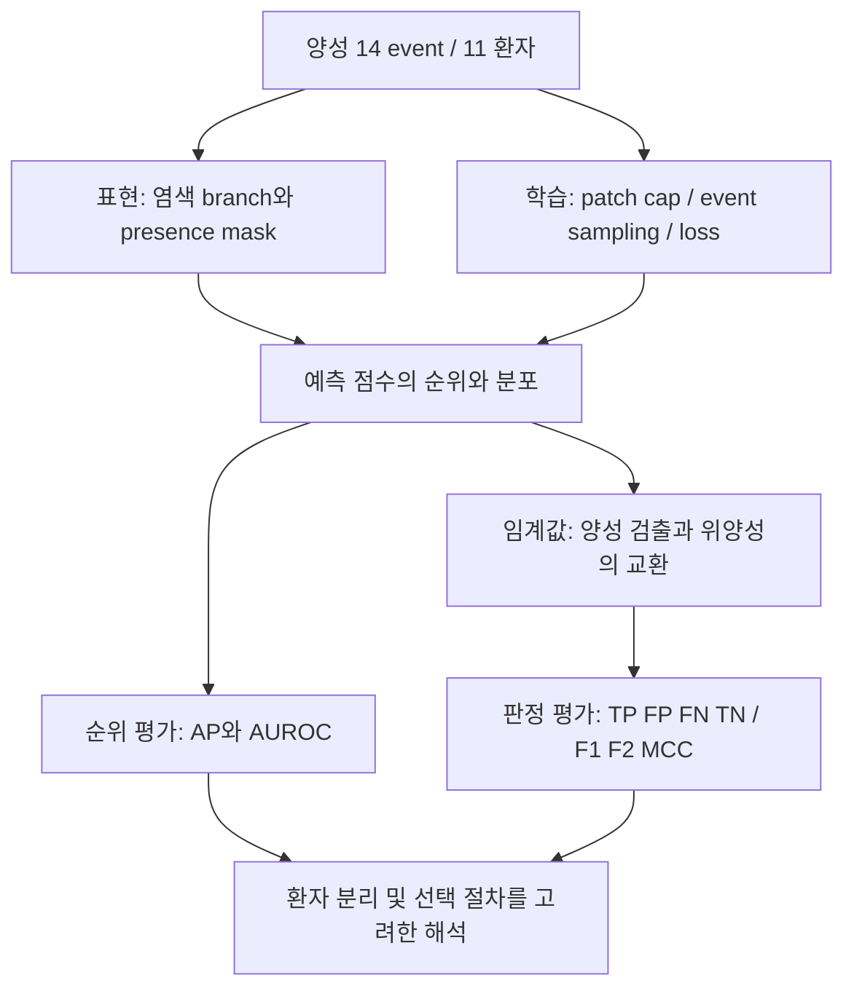

# WSI 연구 종합: 희귀 양성에서 무엇을 확인했고, 무엇이 남았는가

기준일: 2026-10-07. 이 문서는 진행 중인 실험의 종합 해석이다. 원본 결과와 당시
판단은 `experiment_notes/`에 보존하고, 문헌의 개별 근거와 검토 범위는 `reference/`에 둔다.

## 1. 현재 결론

현재 데이터에서는 염색 정보의 사용 방식, patch 노출량, 불균형 처리, 임계값을 바꾸는 것만으로
**부족한 양성 환자의 다양성을 대체하거나 안정적인 성능 향상을 확보하지 못했다.**
이것은 개선 가능성이 없다는 증명이 아니다. 어떤 변경이 어느 지표에서 이득과 비용을
보였는지 확인했으며, 초기의 높은 성능과 독립 평가 결과를 같은 수준의 근거로
해석하면 안 된다는 점이 분명해졌다.

- 표현 방식: presence mask(염색 유무 표시) 제거가 유리하다는 가설은 동일 구조 대조에서 뒷받침되지 않았다.
- 학습: patch 수 증가와 양성을 더 자주 뽑는 sampling 모두 seed 평균과 ensemble에서 결론이 달랐다.
- 판정: F2 임계값은 더 많은 양성을 찾았지만 위양성도 크게 증가했다.
- 평가: 모델·checkpoint·임계값 선택과 평가를 분리한 결과를 우선 보고해야 한다.

새 문헌은 이 관찰을 해석할 방법론적 근거다. 우리 WSI에서 같은 원인이 작동했다는
인과 증거로 사용하지 않는다.

## 2. 연구를 제한하는 데이터 조건

현재 공통 분석 대상은 **575 event, 양성 14 event, 133 환자, 양성 환자 11명,
1,262 slide**다. event가 여러 개인 환자가 있으므로 575개의 독립 표본으로 세지 않는다.
서로 다른 seed도 새로운 환자를 추가하지 않는다.

원래 578 event 중 염색 검토 보류 slide를 제외하면서 양성 3 event가 빠졌다.
`S1617719`, `S1742935`, `S1919367`은 이미 ACR 양성 라벨이 있는 사례이며,
해결할 문제는 **염색 분류 보류**다. 새로운 ACR 판독을 요구하는 사안으로 바꾸지 않는다.
복구한다면 분석 cohort의 버전이 달라지므로 기존 결과를 덮어쓰지 않는다.

추가 WSI 확보는 어렵고 nongold 사례는 병리 ID 연결이 불확실하다. 추정 연결로
양성을 늘리거나, 모델이 틀린 사례를 라벨 오류로 간주하는 것은 현재 근거로 정당화되지 않는다.

## 3. 실험을 하나의 흐름으로 연결하기

아래에서 seed 평균은 반복 실험별 성능의 평균, ensemble은 여러 반복의 예측 점수를
합친 결과다. patch cap은 슬라이드당 학습에 사용할 patch 수의 상한을 뜻한다.

| 질문 | 이번 데이터의 관찰 | 지지하지 못하는 결론 | 현재 판단 |
|---|---|---|---|
| presence mask가 해로운가? | 동일 구조에서 zero-mask의 seed 평균 AP는 0.2992, observed-mask는 0.2916. Ensemble AP는 반대로 0.3363 대 0.3597 | mask 제거의 안정적 우월성, 염색 주문 과정이 원인이라는 주장 | 동일 구조 대조를 기준으로 해석하고 기존 dimension 변경 비교와 구분 |
| patch를 더 보여주면 좋아지는가? | train cap 4096은 2048보다 ensemble AP가 높지만 seed 평균 AP는 낮고 4/5 seed에서 하락 | 새로운 양성 환자 다양성 확보, augmentation의 일반적 실패 | 이번 cap 증가는 기본 개선책으로 채택할 근거 부족 |
| F2 임계값이 실용적인가? | seed 평균 TP 5.6→8.4, FP 26.2→63.6. F2 0.316→0.338, precision 0.196→0.137 | 임상적 순이익 입증, 양성 부족 해결 | 민감도·위양성 비용을 함께 제시하고 기본 판정으로 자동 채택하지 않음 |
| class 균형을 맞추면 AP가 나아지는가? | balanced sampler 평균 AP 0.1764, 자연 CE 0.1645. 그러나 자연 CE가 4/5 seed에서 높고 평균 우위는 seed 31에 민감 | balanced sampler의 안정적 우월성, natural CE의 열등성 | 기존 sampler를 비교 기준으로 유지하되 자연 CE도 유효한 대조군으로 보존 |
| 가중 CE가 해결책인가? | 평균 AP 0.1387, AUROC는 balanced보다 5/5 seed에서 낮음 | 가중 CE의 보편적 실패, 다른 loss가 자동 해결 | 이번 가중치·선택 절차에서는 개선책으로 채택하지 않음 |

표의 수치는 서로 다른 실험 절차의 결과다. **행 사이의 절대 성능으로 모델 순위를
만들지 않는다.** presence/patch 초기 실험, nested threshold/refit, imbalance fit-stop-test는
checkpoint 선택과 학습 데이터 사용이 다르다. 염색 정보와 patch 수를 함께 조합해 비교한 실험도 아니다.

### 양성을 많이 반복하는 것과 양성이 많아지는 것은 다르다

불균형 실험의 balanced sampler는 실제 draw의 약 50%를 양성에 배정했지만 자연
학습에서는 약 2.30%였다. balanced에서는 양성 event당 epoch 평균 노출이 약 22.38회,
자연 학습에서는 1회였다. balanced의 epoch당 고유 event 비율은 약 41.45%였다.
이것은 노출 방식의 큰 차이를 확인한 것이다. 반복 때문에 과적합이 생겨 AP가
낮아졌다는 원인까지 검증한 것은 아니다. 새로운 양성 환자는 추가되지 않았다.

## 4. 새 문헌이 보강하는 해석

아래 7편은 원문을 확보하고 **선택한 abstract/summary 페이지를 텍스트 및 이미지로
확인**했다. 전체 본문·모든 표의 검증을 뜻하지 않는다. 각 카드와 evidence에는
페이지, 추출 줄 번호, 버전 및 `does_not_establish`를 기록했다.

| 문헌 | 확인한 근거 | 우리 연구에 연결하는 범위 |
|---|---|---|
| [van den Goorbergh et al., 2022](https://pmc.ncbi.nlm.nih.gov/articles/PMC9382395/) | Logistic regression에서 class correction이 discrimination을 개선하지 못하고 위험을 과대 추정한 사례 | 불균형 처리·임계값·calibration을 별개로 평가할 이유. WSI sampling의 효과를 직접 입증하지 않음 |
| [Carriero et al., 2025](https://pmc.ncbi.nlm.nih.gov/articles/PMC11771573/) | ML prediction simulation 및 MIMIC-III 사례에서도 class correction의 calibration 문제가 관찰됨 | 위 논점을 다른 예측 모형으로 확장하는 맥락. 신경망 MIL이나 우리 모델의 확률 오류를 입증하지 않음 |
| [Chicco & Jurman, 2020](https://pmc.ncbi.nlm.nih.gov/articles/PMC6941312/) | MCC는 혼동행렬의 네 항을 반영하며 F1/accuracy만 볼 때의 문제를 예시 | F1과 MCC, 원시 오류 수를 함께 보고할 근거. MCC만으로 임상 가치를 판정하지 않음 |
| [Lipton et al., 2014](https://arxiv.org/abs/1402.1892) | F1 최적 임계값은 점수 성질에 의존하며, 잘 보정된 확률에 한해 최적 F1의 절반이라는 관계가 성립 | cutoff 0.5나 F1 최적화를 보편적 해법으로 취급하지 않을 이유. 그 공식을 우리 점수에 직접 적용하지 않음 |
| [Cawley & Talbot, 2010](https://www.jmlr.org/papers/v11/cawley10a.html) | 모델 선택에 쓴 자료에 맞춰지면서 평가 성능이 과대 추정될 수 있음 | checkpoint/threshold 선택과 평가를 분리할 근거. 초기 대비 성능 하락 전부를 이 편향으로 설명하지 않음 |
| [Varoquaux, 2018](https://pubmed.ncbi.nlm.nih.gov/28655633/) | 소표본 CV의 불확실성이 크고 fold 표준오차가 이를 과소평가할 수 있음 | seed std를 환자 모집단의 신뢰구간으로 부르지 않을 이유. 확보본은 2017 arXiv v1이며 NeuroImage 출판연도와 구분 |
| [Riley et al., 2020](https://www.bmj.com/content/368/bmj.m441) | 필요 표본 수는 참여자·발생률·예상 성능·후보 parameter에 의존 | 양성 event뿐 아니라 환자 수와 복잡도를 논의할 근거. 회귀의 EPV 공식을 neural weight/embedding 차원에 대입하지 않음 |

기존 [Saito 2015 카드](../reference/cards/saito2015_precision_recall.json)는 PR 평가를,
[Agniel 2018 카드](../reference/cards/agniel2018_healthcare_process.json)와
[Che 2018 카드](../reference/cards/che2018_grud.json)는 의료 과정 및 결측 정보의
예측 가능성을 보강한다. 후자의 EHR/시계열 결과가 우리 static stain mask의 유익·유해를
직접 판정해주지는 않는다.

## 5. 지표는 질문별로 읽는다

| 질문 | 보고할 지표 | 해석 조건 |
|---|---|---|
| 양성을 상위에 배치하는가? | **AP**, AUROC, prevalence, seed별 대응 결과 | 코드의 `pr_auc`는 average precision인지 확인하여 AP로 명시. AP와 trapezoidal PR 면적을 혼용하지 않음 |
| 실제 몇 건을 잡고 잘못 부르는가? | TP/FP/FN/TN, precision, sensitivity, specificity, F1/F2, MCC | 같은 환자 분할과 사전 지정 cutoff 정책에서 비교. F2 자체가 임상적 이득과 비용을 측정하는 지표는 아님 |
| 확률 0.2를 실제 위험 20%로 읽을 수 있는가? | Brier score, reliability/calibration 평가 | 임계값 성능과 구분. 희귀 양성에서는 전체 Brier가 음성에 지배될 수 있어 단독 해석하지 않음 |
| 결과가 얼마나 불확실한가? | seed별 값, 환자 단위 대응 재표본 차이, 절차의 명시 | 현재 bootstrap은 학습된 모델을 고정한 조건부 구간. 재학습·분할·선택의 전체 불확실성을 포함하지 않음 |

Ensemble은 seed마다 얻은 점수를 결합한 별도 예측기다. seed 평균보다 ensemble이
좋다는 이유로 개별 학습 정책이 안정적으로 개선됐다고 표현하지 않는다.
관측 결과를 반복해서 보고 실험을 골랐으므로, 후속 대조도 새로운 외부 검증으로 간주하지 않는다.

### 독립 평가의 우선순위

기존 presence-aware의 seed 평균 AP 0.2916와 nested/refit의 0.1858은 같은 평가 절차가
아니다. 기존에는 outer validation loss로 checkpoint를 골랐고, 후속 절차는
outer test를 선택에 사용하지 않았다. 동시에 fit 크기, 학습 길이, 초기화도 달라졌다.
따라서 초기 수치를 최종 일반화 성능으로 강조하지도, 차이를 전부 선택 편향으로
계산하지도 않는다. threshold 실험과 imbalance 실험 역시 서로 다른 refit 절차다.

## 6. 지금 할 일과 보류할 일

**집계 완료:** H&E+IHC 비교 가능 대상은 176건·양성 7건·6명이며, H&E가 없는
양성 1건도 확인했다. 기존 분할을 이 부분집합에 적용하면 stop 6/25, test 5/25에서
양성이 없다. 첫 후속 실험은 전체 575건을 유지하는 작은 모델 기준선으로 제안한다.
[염색별 현황·미검출 사례·비교 계획](../experiment_notes/2026-10-07-stain-feasibility-and-next-experiment.md)에
수치와 근거를 정리했다. 아래 항목 중 집계·사례 연결은 완료했고 실제 이미지 검토는 남아 있다.

1. **결과 표와 해석을 고정한다.** 같은 실험 안의 대응 비교, AP 중심 순위 평가,
   임계값별 원시 오류 수를 주 보고로 삼는다. 확실한 승자가 없다는 결과도 보존한다.
2. **기존 결과의 오류 사례를 검토한다.** 불균형 세 조건·모든 seed에서 0.5로 놓친
   7 event/5 환자를 기존 이미지·기록과 연결해 본다. 모델 오류만으로 제외하거나
   라벨을 바꾸지 않는다. `S2134277`은 앞선 절차에서 검출된 적이 있으므로
   일관된 미검출을 사례의 본질적 판별 불가능성으로 해석하지 않는다.
3. **기존 회의 검토 25건 중 제외 양성 3건의 염색을 우선 확정한다.** 복구 가능하면
   별도 cohort 버전과 비교 계획을 만들고, 결과가 좋아지도록 사후 선택하지 않는다.
4. **연구 주장과 한계를 정리한다.** 현재 산출물은 희귀 양성의 고정 cohort에서
   염색 정보·노출 방식·의사결정 정책을 비교한 탐색적 근거다. 임상 적용 성능이나
   양성 부족을 극복한 새 알고리즘으로 주장할 단계는 아니다.

새 loss·더 큰 모델·가중치 탐색을 자동으로 늘리지 않는다. 학습 길이 대조는
사용자와 논의 후 보류된 상태다. 이전 노트의 학습 길이 우선 권고는 현재 계획으로
읽지 않는다. 추가 학습을 시작하려면 남은 구체적 질문과 비교 조건부터 정한다.

## 7. 앞으로의 연구 방향: 제안과 판단 기준

작은 모델 비교는 실행 승인을 받아 [평균 요약 + 로지스틱 회귀 계획](../experiment_notes/2026-10-07-meanpool-baseline-control-plan.md)을
구현했다. 동일 575건·25개 환자 분할을 재사용하며 실제 학습은 서버에서 진행한다.

이 절은 **아직 실행하거나 성능을 확인하지 않은 연구 제안**이다. 기존 대조실험의
결론과 구분한다. 현재 자원 조건은 추가 WSI 확보 불가, nongold 라벨 연결 불확실,
이미 추출한 feature 활용 가능, 양성 환자 11명이다.

### 7.1 권장 주제: 다중 염색의 추가 정보와 그 한계

핵심 질문을 다음과 같이 좁히는 것을 제안한다.

> 양성 환자가 극히 적은 심장이식 생검에서, 다중 염색 이미지의 결합은
> H&E 형태와 염색 구성·취득 과정 정보 이상으로 ACR 판별에 기여하는가?

이 질문은 현재 축적한 염색 라벨, event 단위 묶음, mask 대조, 희귀 양성 평가를
하나의 연구로 연결한다. 단순 성능 최고값 외에도 **어느 정보가 도움이 되고,
어느 효과는 현재 표본에서 구분할 수 없는지**가 결과가 될 수 있다.
다만 유의한 개선이 없다는 것만으로 염색의 정보가 없거나 두 방법이 동등하다고
결론내리지는 않는다.
MADELEINE은 염색 간 정보를 표현 학습에 활용하는 근거지만, 우리의 소표본
event 분류에서 추가 염색의 이득을 검증한 논문은 아니다.
([저자 원문](https://arxiv.org/abs/2408.02859), [검토 카드](../reference/cards/jaume2024_madeleine.json))
따라서 대규모 multistain pretraining을 재현하기보다 기존 feature로 추가 정보부터
확인하는 것이 현재 자원에 맞는 제안이다.

### 7.2 후보별 우선순위

| 우선순위 | 아이디어 / 확인할 질문 | 필요한 작업 | 진행·보류 판단 |
|---|---|---|---|
| 먼저, 추가 학습 없음 | 반복 미검출이 조직량·품질·염색·취득 조건과 함께 나타나는가? | 저장된 평가 예측(OOF)과 이미지 품질(QC)을 연결한 사례표 | 명확한 자료 문제면 전체 cohort에 적용할 QC 규칙을 먼저 검토. 일부 양성만 사후 제외하지 않음 |
| 다음 학습 후보 1 | 단순한 feature 요약과 작은 분류기로도 현재 정보를 활용할 수 있는가? | frozen feature의 평균 pooling + 규제 logistic regression과 기존 attention 모델 비교 | 작은 기준선이 경쟁력 있으면 모델 확장 보류. attention 이득이 일관적이면 그 구조를 후속 기준으로 유지 |
| 다음 학습 후보 2 | 이미지 없이 염색 구성·취득 정보만으로 예측 가능한가? | 소수 메타데이터의 규제 모형, 이미지 모형, 결합 모형 대조 | 메타데이터 신호가 크면 이미지 성능의 출처 해석을 우선. 작아도 이미지 내부 shortcut 부재를 증명하지 않음 |
| 핵심 후속 비교 | 같은 event에서 H&E에 IHC/other 이미지를 추가하면 도움이 되는가? | 동일 대상·분할·선택 절차의 H&E-only 대 multistain 비교 | 환자별·seed별 결과와 불확실성이 추가 염색의 이득을 지지할 때 확장. 작은 부분집합이면 탐색 결과로 제한 |
| 보조 분석, 추가 학습 없이 시작 | 제한된 검토량에서 양성이 상위에 모이는가? | 기존 OOF로 사전 지정 검토 비율별 검출 수·precision 산출 | 검토 우선순위 도구의 가능성만 평가. 실제 업무 절감이나 임상 유용성으로 주장하지 않음 |

모든 후보를 한 번에 grid로 돌리는 계획은 아니다. **기존 사례 점검 → 작은 기준선과
메타데이터 대조 → 다중 염색의 추가 정보** 순으로, 앞 단계 결과를 보고 다음 비교를
구체화한다. 후보와 진행 기준은 이 절의 제안이며 실행 계획은 별도 날짜 노트로 고정한다.

### 7.3 구체적으로 어떻게 비교할 것인가

#### A. 작은 모델로 표현의 정보량을 확인

- 같은 frozen encoder feature를 사용하고, patch 평균 → slide 요약 → event 요약을
  만든 뒤 규제 logistic regression을 기준선으로 둔다. slide를 동일 가중 평균하여
  patch가 많은 slide가 자동으로 지배하지 않게 하는 방식은 사전에 고정한다.
- 기존 attention 모델과 동일한 event·환자 분할·독립 평가 경계를 사용한다.
  표준화나 차원 축소를 쓰면 해당 fit 환자에서만 추정한다. 규제 강도를 선택할 경우
  outer test가 아닌 내부 자료만 사용한다.
- 주 비교는 AP, 보조 비교는 AUROC와 판정 오류 수다. 서로 다른 sampler나 cutoff
  정책을 함께 바꿔 놓고 모델 복잡도만의 효과라고 해석하지 않는다.
- 평균 pooling은 국소 병변 신호를 희석할 수 있다. 낮은 성능이 feature에 정보가
  없다는 증명은 아니다. 이 비교는 pooling·분류기 조합의 실용적 기준선이며
  parameter 수만의 인과 효과를 분리하는 실험은 아니다.

CLAM/ABMIL은 학습 가능한 attention pooling의 근거를 제공한다. 다만 기존 비심장
벤치마크의 이득이 이 cohort에서도 성립하는지는 별도 비교가 필요하다.
([CLAM 원문](https://www.nature.com/articles/s41551-020-00682-w),
[ABMIL 카드](../reference/cards/ilse2018_abmil.json))

#### B. 염색·취득 과정 신호와 이미지 정보를 구분

후보 입력은 stain presence, stain별 slide 수, source dataset 등 이미 확보한 소수
변수다. filename 문자열, 병리 ID, 환자 ID, 진단·보고서 내용처럼 직접적인 식별·결과
단서는 넣지 않는다. 취득 source의 의미와 각 변수가 예측 시점에 이용 가능한지도 기록한다.

단순 메타데이터 모형이 높은 성능을 보이면 염색 선택이나 취득 구성 자체가 라벨과
연관된다는 단서다. 이미지가 형태를 학습하지 않았다는 증명은 아니다. 반대로
메타데이터 모형이 약해도 이미지에 담긴 scanner/site 신호를 배제하지 못한다.
source별 양성 환자가 너무 적으면 source-held-out 평가를 억지로 만들지 않고
분포표와 층별 관찰로 한계를 명시한다.

이는 TCGA에서 취득 기관 신호가 모델 평가를 왜곡할 수 있다는 연구에 근거한
대조 제안이며, SMC에서 그 효과가 확인됐다는 주장은 아니다.
([Howard et al. 원문](https://www.nature.com/articles/s41467-021-24698-1),
[검토 카드](../reference/cards/howard2021_site_signatures.json))

#### C. 다중 염색의 추가 정보 확인

- 먼저 H&E 보유 event와 H&E+IHC 등 비교 가능한 부분집합의 event·양성·환자 수를
  센다. 희귀 양성의 추가 탈락 규모를 모른 채 부분집합 실험을 확정하지 않는다.
- H&E-only와 multistain을 **같은 event**에서 평가한다. 서로 다른 cohort의 AP 차이를
  추가 염색 효과로 해석하지 않는다. 추가 slide 수와 모델 용량도 달라질 수 있음을 기록한다.
- 가능한 설계는 모든 H&E 보유 event에서 결측 추가 염색을 처리하는 비교와,
  실제 두 염색이 모두 있는 부분집합의 대응 비교다. 후자는 선택된 검사를 받은
  사례에 대한 조건부 결과이며 전체 생검으로 일반화하지 않는다.
- 추가 염색의 보유 여부만 주는 모형과 실제 feature를 주는 모형을 구분한다.
  IHC라는 큰 stain group만 확인된 경우 특정 marker의 진단적 역할까지 주장하지 않는다.
- 학습 후 test 시점에 branch를 끄는 분석은 입력 손상에 대한 민감도다. 처음부터
  H&E만으로 학습한 모델과의 비교를 대신하지 않는다.

#### D. 자동 판정보다 검토 우선순위라는 사용 목적 검토

현재 0.5 판정에서 놓치는 양성이 많더라도 상위 순위에 양성이 모이는지는 다른
질문이다. 기존 OOF로 상위 5%·10%·20% 등 **결과를 보기 전에 지정한 검토량**에서
검출 양성 수, precision, 놓친 양성을 함께 기술할 수 있다.
이는 임계값 대조를 다시 돌리는 것과 달리 검토할 사례 수를 제한했을 때 양성을 얼마나 찾는지 보는 분석이다.

이미 결과를 본 cohort이므로 사후 분석임을 표시한다. batch 단위 순위와 실시간
임상 cutoff는 다르며, 한 환자의 반복 event와 fold 간 점수 척도 차이도 고려해야 한다.
처음에는 기존 seed OOF의 기술적 분석으로 한정하고, 실제 업무 배치에 맞는 검증이
없으면 “검토 시간을 줄였다”거나 “자동 진단 가능”이라고 표현하지 않는다.

### 7.4 지금은 조건부로 남길 확장 아이디어

| 방향 | 의미가 생기는 조건 | 현재 제한 |
|---|---|---|
| 병변 중심 ROI/조직 유형 기반 pooling | 오류 검토에서 병변 희석·조직 혼합이라는 구체적 가설이 생기고 검토자 주석 시간을 확보할 때 | heatmap만으로 병변을 확정하지 않음. test 사례에서 얻은 주석을 같은 test 모델의 학습·선택에 재사용하지 않음 |
| AMR 또는 significant rejection으로 같은 질문 확장 | endpoint와 라벨 신뢰도를 고정하고 각각의 염색 정보·양성 환자 수를 먼저 점검할 때 | 더 높은 성능이 나오는 endpoint를 골라 주 결과로 교체하지 않음. 다른 endpoint를 ACR 양성 증강으로 합치지 않음 |
| 라벨 없는 WSI의 domain adaptation/표현 학습 | frozen feature의 한계가 구체화되고 기존 encoder 대비 비교 자원과 독립 평가를 확보할 때 | nongold WSI의 라벨을 추정해서 쓰는 것과 구분. outer test 환자 WSI까지 사전학습에 넣으면 transductive 설정으로 명시해야 함 |
| 임상 경과·치료 반응·미래 위험과의 연결 | 신뢰할 수 있는 환자 연결, 시점 정보와 임상 endpoint가 확보될 때 | 현재 병리 grade 예측이 임상 중증도·미래 위험 예측을 입증하지 않음. 지금의 주 과제를 임의로 바꾸지 않음 |
| 보유 부검 자료와 생검의 연계 | 부검의 이식심장 여부·조직 진단·독립 양성 환자 수·생검과의 환자 연결 및 시점이 확인될 때 | 부검 병변을 이용한 학습 보조 또는 공동 학습을 비교하되 평가 대상은 생검으로 유지. 사망을 거부반응 양성 라벨로 대체하거나 부검 진단을 이전 생검에 소급하지 않음 |

2026-10-07 사용자가 **부검 데이터셋 보유**를 확인했다. 파일 목록·라벨·환자 연결은
아직 미검토다. 심장이식의 생검·부검 병리 비교 연구와 다른 병리 과제의 AI 전이 사례 등 11편을
`autopsy_biopsy_transfer` 경로에 등록했다. 심장 거부반응 공동 학습의 성능 향상을
입증한 근거로 해석하지 않는다. [문헌과 보유 데이터의 확인 항목](../experiment_notes/2026-10-07-autopsy-biopsy-literature-registration.md)을 참고한다.

추가 조사에서 SongCi의 **부검 표현→임상 병리 전이 평가**, Amemiya의 **동일 환자
생검–부검/적출심장 대응 설계**를 확인했다. 부검 병변 위치를 바탕으로 생검 크기
영역에서 검출 변화를 살피는 분석도 가능하다. 원래 심장의 DCM과 이식심장 거부반응은
구분해야 하며, 실제 생검 평가는 별도로 유지한다. [추가 문헌과 세 가지 활용 방향](../experiment_notes/2026-10-07-autopsy-biopsy-expanded-review.md)에 근거 범위와 실행 조건을 정리했다.

추가 WSI 확보를 당장 가능한 해결책으로 전제하지 않는다. 기존 제외 양성 3건의
염색 확정은 가장 가까운 cohort 개선 기회지만, 3건이 복구돼도 희귀 양성 문제 자체가
해소됐다고 보지는 않는다. 새로운 cohort를 쓰면 대응 비교를 새 버전에서 수행한다.

### 7.5 다음 단계의 산출물과 연구 주장

**가장 먼저 만들 산출물**은 오류·QC·염색·source를 연결한 event별 표와, H&E 및
다중 염색 비교 가능 cohort의 환자/양성 수 표다. 이 자료로 작은 기준선과 메타데이터
대조의 계획을 작성하고 나서 추가 학습 범위를 정한다.

연구의 잠정 제목 수준으로는 **“희귀 양성 심장이식 WSI에서 다중 염색의 추가 정보와
평가 안정성”**을 제안한다. 추가 염색의 이득이 재현되면 어떤 조건에서 기여하는지,
재현되지 않으면 어떤 대조에서 이득을 구분하지 못했는지를 보고한다.
두 경우 모두 다른 기관·새 환자에서의 검증이 없는 현재 한계를 유지한다.

## 8. 원본으로 돌아가는 경로

- [초기 대조의 여러 지표 재분석](../experiment_notes/2026-10-05-event-controls-multimetric-reanalysis.md)
- [임계값 대조 결과](../experiment_notes/2026-10-06-nested-threshold-control-results.md)
- [불균형 처리 결과 및 검증](../experiment_notes/2026-10-07-imbalance-control-results.md)
- [이번 문헌 등록 기록](../experiment_notes/2026-10-07-literature-and-experiment-synthesis.md)
- [RAG 사용법·검토 범위](../reference/README.md)

논문 discussion에 사용할 요약: 제한된 양성 환자의 환경에서 class 균형 조정은
기본 임계값의 검출 수를 늘렸지만 순위 성능의 안정적 개선으로 이어지지 않았다.
임계값 최적화 역시 민감도 상승과 위양성 증가를 교환했다. 이러한 관찰은 불균형
처리, calibration, model selection을 분리해야 한다는 선행 방법론과 양립하지만,
해당 방법론이 이 WSI 데이터의 실패 원인을 직접 입증하지는 않는다.
