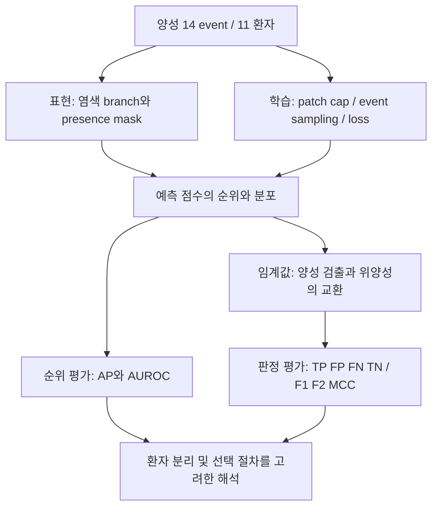

# WSI 연구 종합: 희귀 양성에서 무엇을 확인했고, 무엇이 남았는가

기준일: 2026-10-07. 이 문서는 진행 중인 실험의 종합 해석이다. 원본 결과와 당시
판단은 `experiment_notes/`에 보존하고, 문헌의 개별 근거와 검토 범위는 `reference/`에 둔다.

## 1. 현재 결론

현재 데이터에서는 염색 표현, patch 노출, 불균형 처리, 임계값을 바꾸는 것만으로
**부족한 양성 환자의 다양성을 대체하거나 안정적인 성능 향상을 확보하지 못했다.**
이것은 개선 가능성이 없다는 증명이 아니다. 어떤 변경이 어느 지표에서 이득과 비용을
보였는지 확인했으며, 초기의 높은 성능과 독립 평가 결과를 같은 수준의 근거로
해석하면 안 된다는 점이 분명해졌다.

- 표현 방식: presence mask 제거가 유리하다는 가설은 동일 구조 대조에서 뒷받침되지 않았다.
- 학습: patch 수 증가와 역빈도 sampling 모두 seed 평균과 ensemble에서 결론이 달랐다.
- 판정: F2 임계값은 더 많은 양성을 찾았지만 위양성도 크게 증가했다.
- 평가: 모델·checkpoint·임계값 선택과 평가를 분리한 결과를 우선 보고해야 한다.

새 문헌은 이 관찰을 해석할 방법론적 근거다. 우리 WSI에서 같은 원인이 작동했다는
인과 증거로 사용하지 않는다.

## 2. 연구를 제한하는 데이터 조건

현재 공통 cohort는 **575 event, 양성 14 event, 133 환자, 양성 환자 11명,
1,262 slide**다. event가 여러 개인 환자가 있으므로 575개의 독립 표본으로 세지 않는다.
서로 다른 seed도 새로운 환자를 추가하지 않는다.

원래 578 event 중 염색 검토 보류 slide를 제외하면서 양성 3 event가 빠졌다.
`S1617719`, `S1742935`, `S1919367`은 이미 ACR 양성 라벨이 있는 사례이며,
해결할 문제는 **염색 분류 보류**다. 새로운 ACR 판독을 요구하는 사안으로 바꾸지 않는다.
복구한다면 분석 cohort의 버전이 달라지므로 기존 결과를 덮어쓰지 않는다.

추가 WSI 확보는 어렵고 nongold 사례는 병리 ID 연결이 불확실하다. 추정 연결로
양성을 늘리거나, 모델이 틀린 사례를 라벨 오류로 간주하는 것은 현재 근거로 정당화되지 않는다.

## 3. 실험을 하나의 흐름으로 연결하기

| 질문 | 이번 데이터의 관찰 | 지지하지 못하는 결론 | 현재 판단 |
|---|---|---|---|
| presence mask가 해로운가? | 동일 구조에서 zero-mask의 seed 평균 AP는 0.2992, observed-mask는 0.2916. Ensemble AP는 반대로 0.3363 대 0.3597 | mask 제거의 안정적 우월성, 염색 주문 과정이 원인이라는 주장 | 동일 구조 대조를 기준으로 해석하고 기존 dimension 변경 비교와 구분 |
| patch를 더 보여주면 좋아지는가? | train cap 4096은 2048보다 ensemble AP가 높지만 seed 평균 AP는 낮고 4/5 seed에서 하락 | 새로운 양성 환자 다양성 확보, augmentation의 일반적 실패 | 이번 cap 증가는 기본 개선책으로 채택할 근거 부족 |
| F2 임계값이 실용적인가? | seed 평균 TP 5.6→8.4, FP 26.2→63.6. F2 0.316→0.338, precision 0.196→0.137 | 임상적 순이익 입증, 양성 부족 해결 | 민감도·위양성 비용을 함께 제시하고 기본 판정으로 자동 채택하지 않음 |
| class 균형을 맞추면 AP가 나아지는가? | balanced sampler 평균 AP 0.1764, 자연 CE 0.1645. 그러나 자연 CE가 4/5 seed에서 높고 평균 우위는 seed 31에 민감 | balanced sampler의 안정적 우월성, natural CE의 열등성 | 기존 sampler를 비교 기준으로 유지하되 자연 CE도 유효한 대조군으로 보존 |
| 가중 CE가 해결책인가? | 평균 AP 0.1387, AUROC는 balanced보다 5/5 seed에서 낮음 | 가중 CE의 보편적 실패, 다른 loss가 자동 해결 | 이번 가중치·선택 절차에서는 개선책으로 채택하지 않음 |

표의 수치는 서로 다른 실험 절차의 결과다. **행 사이의 절대 성능으로 모델 순위를
만들지 않는다.** presence/patch 초기 실험, nested threshold/refit, imbalance fit-stop-test는
checkpoint 선택과 학습 데이터 사용이 다르다. 두 표현 실험도 완전한 factorial 설계가 아니다.

### 양성을 많이 반복하는 것과 양성이 많아지는 것은 다르다

불균형 실험의 balanced sampler는 실제 draw의 약 50%를 양성에 배정했지만 자연
학습에서는 약 2.30%였다. balanced에서는 양성 event당 epoch 평균 노출이 약 22.38회,
자연 학습에서는 1회였다. balanced의 epoch당 고유 event 비율은 약 41.45%였다.
이것은 노출 방식의 큰 차이를 확인한 것이다. 반복 때문에 과적합이 생겨 AP가
낮아졌다는 원인까지 검증한 것은 아니다. 새로운 양성 환자는 추가되지 않았다.

## 4. 새 문헌이 보강하는 해석

아래 7편은 원문을 확보하고 **선택한 abstract/summary 페이지를 텍스트 및 이미지로
확인**했다. 전체 본문·모든 표의 검증을 뜻하지 않는다. 각 카드와 evidence에는
페이지, 추출 줄 번호, 버전 및 `does_not_establish`를 기록했다.

| 문헌 | 확인한 근거 | 우리 연구에 연결하는 범위 |
|---|---|---|
| [van den Goorbergh et al., 2022](https://pmc.ncbi.nlm.nih.gov/articles/PMC9382395/) | Logistic regression에서 class correction이 discrimination을 개선하지 못하고 위험을 과대 추정한 사례 | 불균형 처리·임계값·calibration을 별개로 평가할 이유. WSI sampling의 효과를 직접 입증하지 않음 |
| [Carriero et al., 2025](https://pmc.ncbi.nlm.nih.gov/articles/PMC11771573/) | ML prediction simulation 및 MIMIC-III 사례에서도 class correction의 calibration 문제가 관찰됨 | 위 논점을 다른 예측 모형으로 확장하는 맥락. 신경망 MIL이나 우리 모델의 확률 오류를 입증하지 않음 |
| [Chicco & Jurman, 2020](https://pmc.ncbi.nlm.nih.gov/articles/PMC6941312/) | MCC는 혼동행렬의 네 항을 반영하며 F1/accuracy만 볼 때의 문제를 예시 | F1과 MCC, 원시 오류 수를 함께 보고할 근거. MCC만으로 임상 가치를 판정하지 않음 |
| [Lipton et al., 2014](https://arxiv.org/abs/1402.1892) | F1 최적 임계값은 점수 성질에 의존하며, 잘 보정된 확률에 한해 최적 F1의 절반이라는 관계가 성립 | cutoff 0.5나 F1 최적화를 보편적 해법으로 취급하지 않을 이유. 그 공식을 우리 점수에 직접 적용하지 않음 |
| [Cawley & Talbot, 2010](https://www.jmlr.org/papers/v11/cawley10a.html) | 유한 표본의 model-selection criterion 자체에 과적합하여 평가 편향이 생길 수 있음 | checkpoint/threshold 선택과 평가를 분리할 근거. 초기 대비 성능 하락 전부를 이 편향으로 설명하지 않음 |
| [Varoquaux, 2018](https://pubmed.ncbi.nlm.nih.gov/28655633/) | 소표본 CV의 불확실성이 크고 fold 표준오차가 이를 과소평가할 수 있음 | seed std를 환자 모집단의 신뢰구간으로 부르지 않을 이유. 확보본은 2017 arXiv v1이며 NeuroImage 출판연도와 구분 |
| [Riley et al., 2020](https://www.bmj.com/content/368/bmj.m441) | 필요 표본 수는 참여자·발생률·예상 성능·후보 parameter에 의존 | 양성 event뿐 아니라 환자 수와 복잡도를 논의할 근거. 회귀의 EPV 공식을 neural weight/embedding 차원에 대입하지 않음 |

기존 [Saito 2015 카드](../reference/cards/saito2015_precision_recall.json)는 PR 평가를,
[Agniel 2018 카드](../reference/cards/agniel2018_healthcare_process.json)와
[Che 2018 카드](../reference/cards/che2018_grud.json)는 의료 과정 및 결측 정보의
예측 가능성을 보강한다. 후자의 EHR/시계열 결과가 우리 static stain mask의 유익·유해를
직접 판정해주지는 않는다.

## 5. 지표는 질문별로 읽는다

| 질문 | 보고할 지표 | 해석 조건 |
|---|---|---|
| 양성을 상위에 배치하는가? | **AP**, AUROC, prevalence, seed별 대응 결과 | 코드의 `pr_auc`는 average precision인지 확인하여 AP로 명시. AP와 trapezoidal PR 면적을 혼용하지 않음 |
| 실제 몇 건을 잡고 잘못 부르는가? | TP/FP/FN/TN, precision, sensitivity, specificity, F1/F2, MCC | 같은 환자 분할과 사전 지정 cutoff 정책에서 비교. F2는 임상 비용을 측정한 utility가 아님 |
| 확률 0.2를 실제 위험 20%로 읽을 수 있는가? | Brier score, reliability/calibration 평가 | 임계값 성능과 구분. 희귀 양성에서는 전체 Brier가 음성에 지배될 수 있어 단독 해석하지 않음 |
| 결과가 얼마나 불확실한가? | seed별 값, 환자 단위 대응 재표본 차이, 절차의 명시 | 현재 bootstrap은 학습된 모델을 고정한 조건부 구간. 재학습·분할·선택의 전체 불확실성을 포함하지 않음 |

Ensemble은 seed마다 얻은 점수를 결합한 별도 예측기다. seed 평균보다 ensemble이
좋다는 이유로 개별 학습 정책이 안정적으로 개선됐다고 표현하지 않는다.
관측 결과를 반복해서 보고 실험을 골랐으므로, 후속 대조도 새로운 외부 검증으로 간주하지 않는다.

### 독립 평가의 우선순위

기존 presence-aware의 seed 평균 AP 0.2916와 nested/refit의 0.1858은 같은 평가 절차가
아니다. 기존에는 outer validation loss로 checkpoint를 골랐고, 후속 절차는
outer test를 선택에 사용하지 않았다. 동시에 fit 크기, 학습 길이, 초기화도 달라졌다.
따라서 초기 수치를 최종 일반화 성능으로 강조하지도, 차이를 전부 선택 편향으로
계산하지도 않는다. threshold 실험과 imbalance 실험 역시 서로 다른 refit 절차다.

## 6. 지금 할 일과 보류할 일

1. **결과 표와 해석을 고정한다.** 같은 실험 안의 대응 비교, AP 중심 순위 평가,
   임계값별 원시 오류 수를 주 보고로 삼는다. 확실한 승자가 없다는 결과도 보존한다.
2. **기존 결과의 오류 사례를 검토한다.** 불균형 세 조건·모든 seed에서 0.5로 놓친
   7 event/5 환자를 기존 이미지·기록과 연결해 본다. 모델 오류만으로 제외하거나
   라벨을 바꾸지 않는다. `S2134277`은 앞선 절차에서 검출된 적이 있으므로
   일관된 미검출을 사례의 본질적 판별 불가능성으로 해석하지 않는다.
3. **기존 회의 검토 25건 중 제외 양성 3건의 염색을 우선 확정한다.** 복구 가능하면
   별도 cohort 버전과 비교 계획을 만들고, 결과가 좋아지도록 사후 선택하지 않는다.
4. **연구 주장과 한계를 정리한다.** 현재 산출물은 희귀 양성의 고정 cohort에서
   염색 정보·노출 방식·의사결정 정책을 비교한 탐색적 근거다. 임상 적용 성능이나
   양성 부족을 극복한 새 알고리즘으로 주장할 단계는 아니다.

새 loss·더 큰 모델·가중치 탐색을 자동으로 늘리지 않는다. 학습 길이 대조는
사용자와 논의 후 보류된 상태다. 이전 노트의 학습 길이 우선 권고는 현재 계획으로
읽지 않는다. 추가 학습을 시작하려면 남은 구체적 질문과 비교 조건부터 정한다.

## 7. 원본으로 돌아가는 경로

- [초기 대조의 여러 지표 재분석](../experiment_notes/2026-10-05-event-controls-multimetric-reanalysis.md)
- [임계값 대조 결과](../experiment_notes/2026-10-06-nested-threshold-control-results.md)
- [불균형 처리 결과 및 검증](../experiment_notes/2026-10-07-imbalance-control-results.md)
- [이번 문헌 등록 기록](../experiment_notes/2026-10-07-literature-and-experiment-synthesis.md)
- [RAG 사용법·검토 범위](../reference/README.md)

논문 discussion에 사용할 요약: 제한된 양성 환자의 환경에서 class 균형 조정은
기본 임계값의 검출 수를 늘렸지만 순위 성능의 안정적 개선으로 이어지지 않았다.
임계값 최적화 역시 민감도 상승과 위양성 증가를 교환했다. 이러한 관찰은 불균형
처리, calibration, model selection을 분리해야 한다는 선행 방법론과 양립하지만,
해당 방법론이 이 WSI 데이터의 실패 원인을 직접 입증하지는 않는다.
