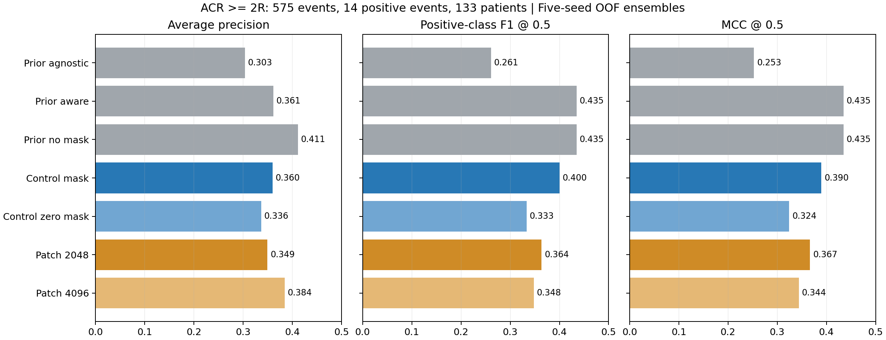
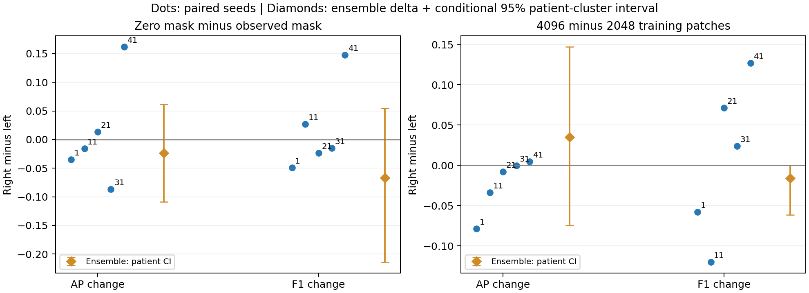

# ACR event 대조실험과 선행 실험의 다중 지표 재분석

## 질문과 분석 범위

심한 class imbalance에서 AUROC·PR-AUC만으로 놓치는 양성 탐지와 오탐의 차이를
확인한다. Presence mask 정보와 학습 patch cap 증가의 효과가 seed별로 반복되는지,
ensemble의 개선이 개별 모델의 개선과 일치하는지를 검토한다.

- 현재 ACR high: 575 events, 양성 14(2.4348%), 환자 133, 양성 환자 11.
- UNI2 40x features, hidden_dim 128, 5-fold patient-grouped CV, seeds 1/11/21/31/41.
- 분류 지표 임계값은 모두 **0.5로 고정**. OOF에 맞춘 threshold 최적화는 하지 않았다.
- 데이터 수신 commit: `7a690b1`(완료된 대조실험 결과와 F1 평가 코드의 merge).
- 기존 provisional ablation 15개, presence control 10개, patch control 10개: 현재 코호트 35개 실행.
- 이전 gold event-MIL 90개와 slide-CLAM→event 60개 OOF도 재계산했다.
  과거 ACR 예측을 현재 575 IDs로 제한한 50개 추가 평가를 포함해 총 47조건,
  235개 seed별 평가. 이는 235개의 독립 실험/데이터셋이라는 뜻은 아니다.
- 별도로 초기 HE augmentation 탐색의 선택된 validation 예측 3조건도 재검토했다.

기존 578-event gold 코호트와 현재 575-event provisional 코호트를 섞어 평균하지 않았다.
과거 예측의 575-ID 제한은 평가 대상만 맞춘 사후 분석이며, 학습 코호트·stain·split이
현재와 같아지는 것은 아니다. 해당 비교는 효과의 인과적 추정으로 사용하지 않는다.

## 재현 근거와 결과 위치

- [분석 코드](../tools/reanalyze_smc_event_controls.py)
- [그림 코드](../tools/plot_smc_metric_review.py)
- [분석 manifest](../results/smc_metric_review_20261005/analysis_manifest.json): 입력 329개 SHA-256,
  seed별 설정 차이, event/label/patient/fold 정렬 검증, patch 초기화 해시 검증.
- [Ensemble 및 seed 평균/표준편차](../results/smc_metric_review_20261005/ensemble_metrics.csv)
- [개별 seed 지표](../results/smc_metric_review_20261005/per_seed_metrics.csv)
- [동일 seed 간 차이](../results/smc_metric_review_20261005/paired_seed_deltas.csv)
- [환자 단위 bootstrap 비교](../results/smc_metric_review_20261005/paired_patient_bootstrap.csv)
- [양성 사례별 변화](../results/smc_metric_review_20261005/positive_case_changes.csv)
- [Seed 예측 다양성](../results/smc_metric_review_20261005/seed_prediction_diversity.csv)
- [초기 HE 탐색 재계산](../results/smc_metric_review_20261005/historical_he_exploration.csv)

```bash
python tools/reanalyze_smc_event_controls.py --bootstrap 2000
python tools/plot_smc_metric_review.py
```

## 볼 지표와 해석 기준

| 지표 | 이번 분석에서의 역할 | 해석 제한 |
|---|---|---|
| PR-AUC/AP + 양성 비율 | 희소 양성을 상위 점수로 올리는 능력 | 코호트·양성 비율이 다른 실험의 숫자를 바로 비교하지 않는다. 여기서 PR-AUC는 average precision이다. |
| AUROC | 전체 순위 분리 능력 | 높은 AUROC만으로 높은 양성 검출률/precision을 보장하지 않는다. |
| Positive F1 + precision + sensitivity | 양성 탐지와 오탐의 균형 | TN을 반영하지 않고 threshold에 의존한다. |
| MCC + balanced accuracy | TP/FP/TN/FN을 함께 고려 | threshold에 의존하며 극소수 양성 때문에 여전히 변동성이 크다. |
| TP/FP/FN/TN | 성능 차이가 실제 몇 건인지 | 양성 한 건은 sensitivity 7.14%p에 해당한다. |
| Sensitivity @ specificity 90/95% | 높은 특이도에서 얻을 수 있는 탐지율 | OOF ROC에서 계산한 사후 진단값이며, 배포 threshold를 검증한 결과가 아니다. |
| F2 | sensitivity에 더 무게를 준 보조값 | recall 가중치 2는 이번 분석의 참고 설정이며 임상 비용을 검증한 값이 아니다. |
| NPV | 음성 판정의 정확도 | 전부 음성으로 예측해도 97.57%여서 높은 NPV 자체는 강한 근거가 아니다. |
| Brier score / log loss | 확률 예측 오차 | calibration만 측정하지 않는다. 특히 전체 Brier는 음성 다수의 영향을 받는다. |
| 양성/음성별 Brier, balanced Brier | 전체 오차에 가려진 양성 확률 오차 | 클래스별 오차를 같은 비중으로 보는 진단값이며 원래 유병률에서의 calibration 지표로 해석하지 않는다. |

MCC 정의는 [scikit-learn 공식 문서](https://scikit-learn.org/stable/modules/generated/sklearn.metrics.matthews_corrcoef.html),
확률 점수의 해석은 [calibration 문서](https://scikit-learn.org/stable/modules/calibration.html)를 참고했다.
Brier 감소만으로 calibration 개선을 확정하지 않는다.
관련 RAG evidence는 `atom-saito2015_precision_recall`을 참조한다. 해당 evidence는
PR 관점의 필요성을 뒷받침하지만 이번 성능 차이의 유의성이나 clinical threshold를 증명하지 않는다.

## 현재 575-event 코호트의 결과

5-seed 평균 확률 ensemble, threshold 0.5:

| 조건 | AUROC | AP | F1 | Precision | MCC | TP / FP / FN |
|---|---:|---:|---:|---:|---:|---|
| 이전 agnostic | 0.9423 | 0.3033 | 0.2609 | 0.3333 | 0.2528 | 3 / 6 / 11 |
| 이전 aware | 0.9279 | 0.3612 | 0.4348 | 0.5556 | 0.4346 | 5 / 4 / 9 |
| 이전 aware_nomask | 0.9138 | 0.4110 | 0.4348 | 0.5556 | 0.4346 | 5 / 4 / 9 |
| 동일 구조 mask 제공 | 0.9301 | 0.3597 | 0.4000 | 0.4545 | 0.3898 | 5 / 6 / 9 |
| 동일 구조 mask=0 | 0.9265 | 0.3363 | 0.3333 | 0.4000 | 0.3243 | 4 / 6 / 10 |
| Patch cap 2048 | 0.8984 | 0.3492 | 0.3636 | 0.5000 | 0.3666 | 4 / 4 / 10 |
| Patch cap 4096 | 0.9102 | 0.3841 | 0.3478 | 0.4444 | 0.3437 | 4 / 5 / 10 |



서로 다른 실험 계열의 최고값만 골라 최종 성능으로 보고하지 않는다. 같은 코호트라도
architecture, fold seeding, sampling 구현 등이 동시에 달라질 수 있다.

## Presence mask: 관측과 수정한 해석

동일 구조·paired fold seeding에서 mask=0 minus mask 제공의 ensemble AP 차이는
**−0.0233**, F1은 −0.0667, MCC는 −0.0656이다.
Mask 제공에서는 양성 `S2247860`을 0.5572, mask=0에서는 0.4805로 예측해 threshold 0.5에서
양성 판정 한 건이 바뀌었다. 두 조건 모두 이 사례를 양성으로 예측한 seed는 3/5이지만,
확률 평균이 판정 경계를 넘는지는 달랐다.

개별 seed의 AUROC는 mask=0에서 4/5 낮아졌다. AP는 3/5 낮아졌지만 seed41의
큰 증가(+0.1624)로 인해 seed 평균은 0.2916→0.2992로 조금 올랐다.
Ensemble과 seed 평균의 방향이 달라, mask 제거의 일관된 개선은 관찰되지 않았다.

이전 aware_nomask의 높은 AP를 "presence 정보가 해롭다"고 해석한 가설은 이번 동일 구조
대조에서 지지되지 않는다. 입력 차원을 줄이는 nomask와 같은 차원에서 mask를 0으로 두는
조작은 다르다. 0 고정에서도 없는 branch의 embedding 등으로 missingness가 남을 수 있어,
이 실험이 missingness 정보의 완전 제거를 검증한 것은 아니다.
Presence 조건에서는 paired seeding 설정과 fold 일치를 확인했으나 초기화 가중치의 저장
해시는 없다. 실제 해시로 동일 초기화를 확인한 것은 patch 대조이다.

## Patch sampling: 단일 모델과 ensemble에서 다른 결과

학습 cap만 2048→4096으로 바꾸고 평가 cap은 2048이다. No mask·동일 구조·paired fold
seeding을 사용했으며, 다섯 seed×다섯 fold의 초기화 해시가 두 조건에서 일치한다.

- 개별 seed AP 차이(4096−2048): seed1 −0.0787, 11 −0.0336, 21 −0.0080, 31 −0.0004, 41 +0.0045.
  **4/5에서 낮아졌다.** 평균 AP는 0.3343→0.3111이다.
- 평균 AUROC의 개선은 seed21(+0.0718), 41(+0.0605)이 이끌었고 나머지 3/5에서는 낮아졌다.
- Ensemble AP는 0.3492→0.3841(+0.0348)이지만 F1은 0.3636→0.3478이다.
  같은 양성 네 건을 검출했고 FP가 4→5로 늘었다. 양성의 threshold 판정은 한 건도 바뀌지 않았다.
- 개별 seed F1 평균은 0.3478→0.3566이지만 SD는 0.0270→0.0784로 커졌다.
- 양성 사례에서 seed 간 확률 상관은 평균 0.715→0.573, 음성에서는 0.638→0.599이다.
  Seed 예측의 차이가 ensemble에서 보완된다는 가설과 맞지만 상관만으로 원인을 확정하지 않는다.

"Patch를 늘리면 단일 모델이 개선된다" 또는 "class imbalance를 극복했다"고 기록하지 않는다.
4096은 ensemble 후보로 남기고 기본 cap은 2048을 유지한다.

## 불확실성

환자를 단위로 환자 내 모든 event를 유지한 paired bootstrap을 2,000회 수행했다.
같은 재표본으로 두 조건을 평가해 percentile 95% 구간을 계산했다.

| 비교(오른쪽−왼쪽) | Ensemble AP 차이 | 조건부95% 구간 |
|---|---:|---|
| Mask=0 − mask提供 | −0.0233 | [−0.1087, +0.0619] |
| Cap4096 − cap2048 | +0.0348 | [−0.0744, +0.1475] |
| 以前nomask − 以前aware | +0.0498 | [−0.0361, +0.1596] |
| 以前nomask − 以前agnostic | +0.1077 | [−0.1175, +0.3521] |



이는 고정된 OOF 확률에 조건부인 표본 변동이다. 재학습·분할·모델 선택의 불확실성을
포함하지 않으므로 CV 성능의 완전한 confidence interval로 보지 않는다.
다섯 seed나 fold를 독립된 환자 표본으로 세지도 않는다. 구간에 0이 포함된다는 사실은
동등성의 증명이 아니다. 이번 결과로 우월성이나 임상 사용 가능성을 확정하기는 부족하다.

## 확률 예측 오차와 NPV

현재 ensemble의 전체 Brier는 0.0193–0.0226이다. 현재 코호트의 양성 비율을 이용한
상수 확률 reference의 Brier는 0.02376으로, 전체 평균은 개선됐다.
다만 이는 관측 코호트에서의 참고값이며, 훈련 데이터만으로 정한 독립 baseline은 아니다.
양성만의 Brier는 약 0.478–0.555, 음성은 0.0078–0.0094여서 양성 쪽의 큰 오차가
전체 평균에 가려진다. 작은 전체 Brier만으로 양성 확률이 충분히 정확하다고 판단하지 않는다.
NPV도 0.9806–0.9841로, 전부 음성 예측의 0.9757을 크게 넘지 않는다.
현재 threshold에서 양성 14건 중 9–11건을 놓친다는 사실을 함께 기록한다.

## 선행 실험의 재정리

### Gold 578-event 예측을 현재 평가 IDs로 제한

같은 과거 aware 40x 예측에서도, 578 events/양성17에서 575 events/양성14로 평가 대상을
제한하면 AP가 **0.5576→0.4322**, F1은 0.5000→0.3636으로 내려갔다.
이 과정에서 학습된 예측값은 바꾸지 않았다. 제외된 양성3건은 이전 ensemble이 모두 검출했다
(TP 7→4). 따라서 이전과 현재의 표면적인 성능 차이에는 평가 집단의 변화가 크게 관여한다.
이 결과만으로 미확정 stain을 확정하거나 사례를 복귀시키지는 않는다.

### 이전 gold의 배율 선택도 지표에 따라 달라진다

| Task | 지표 | 40x | 20x | 10x | 5x |
|---|---|---:|---:|---:|---:|
| ACR high | AP | 0.5576 | 0.5024 | 0.5112 | 0.5200 |
| ACR high | F1 | 0.5000 | 0.4828 | 0.5926 | 0.5385 |
| AMR positive | AP | 0.3388 | 0.4207 | 0.4082 | 0.3670 |
| Significant rejection | AP | 0.3933 | 0.5163 | 0.4421 | 0.4156 |

ACR에서 40x가 모든 지표의 최적은 아니었고, 이전 gold의 AMR/복합 target에는 20x가 유망했다.
이는 이전 578-event 설정의 결과이므로 현재 ACR 대조에 순위를 그대로 적용하지 않는다.
이전 slide-CLAM→event의 ACR40x는 578집단에서 AP0.4011/F1 0.3704, 현재 IDs에서는
AP0.2561/F1 0.1905였다. Event 분기 구조를 유지하는 설계에 서술적인 근거는 있으나,
학습 설정이 다른 비교이므로 branch만의 효과로 단정하지 않는다.

### 초기 HE augmentation 탐색

선택된 validation 집합 75 events/양성20에서 original_1view AP는 0.4345,
geometry_2view와 geometry_he_scale_light_2view는 모두 0.4300이었다.
AUROC는 세 조건 모두 0.6427, F1은 0.4138, precision은 0.6667, MCC는 0.3340이었다.
Brier는 0.1870→0.1897/0.1904로, 개선을 관찰하지 못했다.
이 집합은 현재 575-event ACR-high와 다르고, checkpoint 선택에도 사용한 validation 결과다.
독립 test의 augmentation 효과나 환자 다양성의 증가를 나타내는 결과는 아니다.
이전 WSI/future/weakunique 중 summary만 있는 실험은 원시 PKL 예측이 미공유 상태이므로
이번에 새로운 F1 등을 추정해서 추가하지 않았다.

## 판단과 다음 작업

1. AP를 주요 순위 지표로 두고 F1·precision·sensitivity·MCC·혼동행렬을 같은
   threshold로 함께 기록한다. AUROC와 확률 오차 진단도 보조로 유지한다.
2. Presence mask가 해롭다는 이유로 제거하는 판단은 보류한다. 동일 구조 대조에서는
   mask 제공이 ensemble에 유리했으나, 그 우월성도 확정되지 않았다.
3. 학습 cap2048을 기본 조건으로 유지하고 4096은 ensemble 후보로 남긴다.
   이번 AP 차이를 이유로 곧바로 대규모 augmentation을 확장하지 않는다.
4. 25건의 보류 검토에서 제외된 ACR 양성3건을 우선한다. 충분한 stain 확인과
   데이터 정의에 대한 합의 후, 복귀 시 manifest와 split을 새 버전으로 평가한다.
5. 다음에 threshold/calibration을 검토한다면 바깥 OOF를 선택에 사용하지 않고
   training/inner validation만으로 정하는 설계를 먼저 정의한다.

이 노트는 이전 대화의 잠정 해석을 수정·구체화하는 기록이다. RAG의 missingness·shortcut
문헌은 배경 가설이며, 이번 mask 차이의 원인을 증명하는 자료로 사용하지 않는다.
