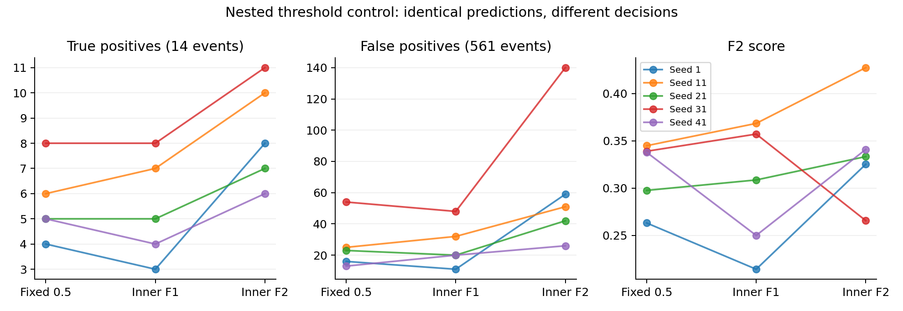

# 2026-10-06: 임계값 대조실험 결과와 다음 의사결정

## 요약

F2 기준은 모든 seed에서 0.5보다 양성을 더 찾았다. 그러나 위양성 증가가 커서
현재 기본 판정 기준으로 채택하지 않는다. F1 기준도 일관적인 개선을 보이지 않았다.
이번 결과는 임계값 변경의 가능성과 비용을 보여주지만 양성 환자 부족을 해결하지 않는다.

다음 순서는 병리 검토로 제외 양성 3건을 확인하고, 모델 확장에 앞서 내부 학습 길이
선택과 refit의 안정성을 검증하는 것이다. 추가 학습은 이 노트 작성 과정에서 실행하지 않았다.

## 원본과 검증

- 서버 결과 Git commit: `1c85034`.
- 데이터: 575 event, 양성 14 event, 133 환자, 양성 환자 11명.
- 원본: `results/smc_event_threshold_control_20261005_exclude25`.
- 기존 [사전 계획](2026-10-05-nested-threshold-control-plan.md)의 F2 주 비교/F1 보조 비교 유지.
- [분석 스크립트](../tools/analyze_smc_threshold_control.py)는 원본을 수정하지 않는다.
- 25개 outer fold, 75개 inner fold의 환자 분리, event 커버, 환자·라벨 일치 확인.
- 저장된 stop loss 최솟값과 best epoch 일치, 내부 epoch 중앙값과 실제 refit 길이 일치 확인.
- 내부 F1/F2 최대화 및 높은 임계값 동률 규칙을 재계산하고 sklearn F-beta와 대조.
- 저장된 임계값·판정 및 15개 seed/조건 지표를 다시 계산하여 서버 요약과 일치 확인.
- 기존 presence-aware와 patch2048의 event·환자·라벨·outer fold가 이번 결과와 동일한지 확인.
- 서버 protocol에 기록된 학습 코드 SHA256을 로컬 LF 정규화 코드와 대조하여 일치 확인.
- checkpoint 가중치는 서버에 남아 있어 실물 가중치 내용이나 GPU 재현성은 검증하지 않았다.

## 지표: seed 평균

| 판정 기준 | TP | FP | FN | 민감도 | 특이도 | Precision | F1 | F2 | MCC |
|---|---:|---:|---:|---:|---:|---:|---:|---:|---:|
| 기본 0.5 | 5.6 | 26.2 | 8.4 | 0.400 | 0.953 | 0.196 | 0.253 | 0.316 | 0.247 |
| 내부 F1 | 5.4 | 26.2 | 8.6 | 0.386 | 0.953 | 0.181 | 0.235 | 0.300 | 0.231 |
| 내부 F2 | 8.4 | 63.6 | 5.6 | 0.600 | 0.887 | 0.137 | 0.216 | 0.338 | 0.243 |

이는 5개 seed의 평균이며 소수점 TP는 환자 일부를 뜻하지 않는다.
같은 예측에 임계값만 다르게 적용하므로 모든 조건의 평균 AUROC 0.798243,
평균 AP 0.185762는 동일하다. seed 평균이며 5-seed ensemble의 성능이 아니다.

### 주 비교: F2 대 기본 0.5

| Seed | TP: 기본 → F2 | FP: 기본 → F2 | 추가 TP | 추가 FP | F2 변화 |
|---|---:|---:|---:|---:|---:|
| 1 | 4 → 8 | 16 → 59 | 4 | 43 | +0.0620 |
| 11 | 6 → 10 | 25 → 51 | 4 | 26 | +0.0825 |
| 21 | 5 → 7 | 23 → 42 | 2 | 19 | +0.0357 |
| 31 | 8 → 11 | 54 → 140 | 3 | 86 | −0.0733 |
| 41 | 5 → 6 | 13 → 26 | 1 | 13 | +0.0031 |

추가 TP 평균 2.8, 추가 FP 평균 37.4다. 두 평균의 비는 추가 TP 1건당 FP 약 13.4건이다.
모든 seed에서 추가 양성이 있었고 기존 0.5에서 잡았던 양성을 놓친 경우는 없었다.
F2 점수는 4/5 seed에서 높았지만 seed 41 개선은 작고 seed 31에서는 악화됐다.
F1은 4/5 seed에서 낮아졌고 나머지 1개에서는 같았다. Precision은 모든 seed에서 낮아졌다.

seed 31의 FP 140개 중 111개가 outer fold 2·3에 집중된다.
두 fold의 F2 임계값은 각각 0.016868, 0.097484이고 refit 길이는 2, 1 epoch다.
이 동시 발생만으로 짧은 학습이 FP 증가의 원인이라고 단정하지 않는다.

### 보조 비교: F1 대 기본 0.5

F1 점수는 seed 21·31에서만 상승했고 seed 1·11·41에서 하락했다.
추가로 찾은 양성과 놓친 양성이 동시에 있었다. 위양성 평균은 같지만
같은 event가 판정된 것은 아니므로 평균 FP만 보고 동등하다고 말하지 않는다.

## 환자 단위 불확실성

133명 환자를 단위로 2,000번 복원 추출하고 같은 표본을 모든 seed와 조건에 적용했다.
각 표본에서 seed 평균 지표 차이를 계산했다. 한 환자의 여러 event는 함께 움직인다.
아래는 **이미 학습된 모델과 선택된 임계값을 고정한 조건부 95% percentile 구간**이다.
학습·분할·임계값 선택을 다시 수행한 신뢰구간이나 전체 CV 불확실성이 아니다.

| F2 − 기본 0.5 | 차이 | 조건부 구간 |
|---|---:|---:|
| 민감도 | +0.2000 | +0.1167 ~ +0.2889 |
| 특이도 | −0.0667 | −0.0840 ~ −0.0509 |
| F1 | −0.0365 | −0.1150 ~ +0.0434 |
| F2 | +0.0220 | −0.0869 ~ +0.1138 |

민감도 상승과 특이도 하락의 방향은 이 조건부 재표본에서도 일관적이다.
종합 F2 개선 구간은 0을 포함한다. 임상 비용을 반영한 이득이 검증되었다고 결론내리지 않는다.

## 임계값과 학습 안정성

- F1 임계값 범위 0.049765–0.990716, 중앙값 0.442224.
- F2 임계값 범위 0.000461–0.500020, 중앙값 0.092033.
- refit 길이 범위 1–29 epoch, 중앙값 3. **25개 중 20개가 4 epoch 이하**다.
- 내부 stop에는 양성 event 1–5개, 실제 양성 환자 1–2명만 들어간다.
- 내부 fit에는 양성 event 4–8개, 양성 환자 4–6명이 들어간다.

`min_epochs=10`은 내부 early stopping 루프를 최소 10회 실행한다는 뜻이다.
그 이전 epoch도 checkpoint 후보이므로 best epoch가 1일 수 있고,
best epoch 중앙값으로 길이를 정한 refit은 10회 미만일 수 있다. 설정 구현 오류는 아니지만
임상 데이터가 적은 stop 집합에서 고른 짧은 학습 길이를 refit에 전달하는 설계의 취약점이다.
최소 refit epoch를 결과를 본 뒤 임의로 바꿔 이번 결과를 덮어쓰지 않는다.

내부 모델과 전체 outer-training refit 모델은 학습 집합 크기와 RNG가 다르다.
따라서 같은 임계값을 넘겨도 점수 분포가 유지된다는 보장은 없다.

## 앞선 실험과 성능 차이

| 절차 | seed 평균 AUROC | seed 평균 AP |
|---|---:|---:|
| 기존 presence-aware | 0.900000 | 0.291611 |
| 기존 patch2048 (nomask) | 0.866259 | 0.334347 |
| 이번 nested/refit (aware) | 0.798243 | 0.185762 |

presence-aware와 이번 모델은 구조·patch cap은 같지만 checkpoint 선택과 학습 집합/길이 절차가 다르다.
기존에는 바깥 validation loss로 checkpoint를 선택한 뒤 그 validation에서 OOF를 보고했다.
이번에는 outer test를 선택에 사용하지 않았다. 따라서 기존 지표가 더 낙관적일 수 있다는
평가 한계를 명시해야 한다. 실제 차이 중 얼마가 선택 편향, 학습 길이,
내부 적은 양성, 초기화 차이 때문인지는 이번 결과만으로 분리할 수 없다.
patch2048은 mask 구조 및 sampler도 다르므로 추가 원인 분리가 불가능하다.

기존 성능을 새 독립 평가 성능처럼 취급하거나, 이번 성능 하락을 임계값 조정 때문이라고
해석하지 않는다. 이번 세 임계값 간 비교는 같은 모델 예측을 사용하므로 그 효과만 비교할 수 있다.

## 사례 검토 표

[`positive_event_review.csv`](../results/smc_threshold_review_20261006/positive_event_review.csv)에
양성 14개 전부의 seed별 검출 횟수와 F2 추가 검출 횟수를 정리했다.

- `S1952033`: 기본 0.5에서 0/5 seed, F2에서 3/5 seed 검출.
- `S2128633`, `S2134279`, `S2210209`: 기본 0/5에서 F2 각각 1/5, 2/5, 1/5.
- `S2148221`: 세 기준 모두 0/5. 원본 조직·feature coverage를 검토할 우선 대상이다.
- `S2128633`, `S2134279`, `S2148221`은 동일 환자다. 서로 독립된 양성 환자로 세지 않는다.

여러 seed 중 한 번이라도 잡힌 수는 ensemble 성능이 아니며 13/14 민감도로 보고하지 않는다.

[`negative_event_review.csv`](../results/smc_threshold_review_20261006/negative_event_review.csv)에는
음성 event의 seed별 FP 횟수를 정리했다. F2에서 한 번이라도 FP인 event 181개,
3개 이상 seed에서 FP인 event 37개, 모든 seed에서 FP인 event 11개다.
검토가 필요하면 우선 11개 반복 FP부터 살펴볼 수 있다. 라벨 오류의 증거로 해석하지 않는다.

patient-any-positive 집계도 저장했다. 한 환자가 가진 모든 event 중 실제 양성이 하나라도
있으면 양성 환자, 예측 양성이 하나라도 있으면 환자 alert로 정의한다.
양성 환자의 **다른 음성 biopsy에서의 잘못된 양성 판정도 patient TP로 집계될 수 있다**.
따라서 biopsy 검출 성능을 대체하거나 시간 순서가 있는 임상 screening 성능으로 사용하지 않는다.

## 결정과 다음 작업

1. F2 임계값을 현행 기본 판정으로 채택하지 않는다. 민감도 중심의 탐색 후보로 보관한다.
2. F1 최적화 임계값도 개선책으로 채택하지 않는다.
3. 앞선 mask/patch 실험은 비교 자료로 유지하되 outer-validation checkpoint 선택의 한계를 기록한다.
4. 회의에서는 pending 25건 중 제외된 양성 `S1617719`, `S1742935`, `S1919367`의 stain 확인을 우선한다.
   확인 후 새 데이터 버전으로 복구하며 임계값 실험에서 제외 상태를 임의로 바꾸지 않는다.
5. 다음 학습을 설계한다면 모델 확장보다 **학습 길이 대조실험**을 우선한다.
   환자 분할과 구조를 고정하고, 사전에 정한 epoch budget과 현재 내부 선택 절차를 비교한다.
   임계값까지 동시에 바꾸지 말고 먼저 0.5에서 AUROC/AP와 판정 변화를 비교해 원인을 좁힌다.
   이는 후속 탐색 실험이다. 바깥 결과를 보고 budget을 반복 최적화하지 않는다.

## 산출물

- 분석 결과: [`results/smc_threshold_review_20261006`](../results/smc_threshold_review_20261006).
- fold별 진단: `fold_threshold_diagnostics.csv`.
- seed별 재계산 지표: `verified_per_seed_metrics.csv`.
- 실제 판정 전환: `call_transitions.csv`.
- 조건부 구간: `conditional_patient_bootstrap.csv`.
- 이전 절차 비교: `prior_protocol_comparison.csv`.
- 원본 SHA256·검증 범위: `analysis_manifest.json` (LF 정규화 해시).
- 아래 그림은 seed별 반복 결과이며 선은 조건 간 대응만 나타낸다.

