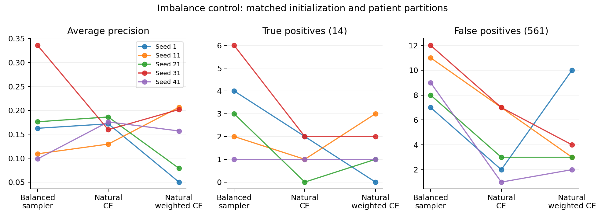

# 2026-10-07: 불균형 처리 대조실험 결과

## 결론

역빈도 샘플링은 0.5 판정에서 자연 비율 학습보다 양성을 더 찾았지만,
**주 지표 AP에서 안정적으로 우월하지 않았다**. 자연 비율 CE의 AP가 4/5 seed에서
더 높았고, 역빈도 샘플링의 평균 AP 우위는 seed 31의 큰 차이에 민감했다.
가중 CE는 이번 구현·가중치·optimizer·checkpoint 선택 조건에서 개선책이 되지 못했다.
불균형을 다루는 세 방식 중 확실한 승자를 정하거나 양성 부족을 극복했다고 결론내리지 않는다.

역빈도 샘플링은 기존 비교 기준으로 남긴다. 자연 CE는 AP에서 경쟁력 있는 대조군으로
유지하며, 단순히 0.5에서 양성을 적게 부른다는 이유로 폐기하지 않는다.
가중 CE의 추가 가중치 탐색이나 더 복잡한 loss 확장은 이번 결과를 근거로 시작하지 않는다.

## 원본과 검증

- 서버 원본 Git commit: `efb95f6`.
- [사전 계획](2026-10-06-imbalance-handling-control-plan.md) 유지: 주 지표 AP,
  임계값 0.5, 동일 architecture/initialization/fit-stop-test 환자, refit 없음.
- cohort: 575 events, 양성 14 events, 133 환자, 양성 환자 11명.
- 원본: `results/smc_event_imbalance_control_20261006_exclude25`.
- [분석 코드](../tools/analyze_smc_imbalance_control.py)는 feature나 checkpoint 없이
  서버에서 공유된 원본 기록을 읽어 독립적으로 대조한다. 원본은 수정하지 않았다.
- protocol의 학습 코드 7개 SHA256을 로컬 LF 정규화 내용과 대조하여 일치 확인.
- 25개 환자 분할의 fit/stop/test 중복 없음, event 커버 및 patient-label 일치 확인.
- 75개 학습의 초기 parameter hash가 대응 조건 간 동일한지 확인.
- 실제 event draw가 fit 집합 안에만 있는지, label·step·epoch·draw 집계가 일치하는지 확인.
- 두 natural 조건이 공통 실행 epoch에서 완전히 동일한 event 순서를 쓰는지 확인.
- stop loss 최솟값과 선택 epoch/기록된 loss 일치 확인.
- fold 파일을 합친 OOF와 seed OOF 일치, 환자당 outer fold 하나인지 확인.
- 15개 seed/조건의 지표를 재계산하여 서버 요약과 일치 확인.
- 실제 checkpoint 가중치 내용이나 GPU 재학습 재현성은 검증하지 않았다.

## 평균 지표

5개 seed 평균이며 ensemble 성능이 아니다. 개별 seed는 동일 환자의 반복 평가다.

| 방식 | AUROC | AP | AP std | TP | FP | FN | 민감도 | F1 | F2 |
|---|---:|---:|---:|---:|---:|---:|---:|---:|---:|
| 역빈도 sampler | 0.7666 | 0.1764 | 0.0951 | 3.2 | 9.4 | 10.8 | 0.2286 | 0.2333 | 0.2297 |
| 자연 CE | 0.7511 | 0.1645 | 0.0218 | 1.2 | 4.0 | 12.8 | 0.0857 | 0.1224 | 0.0970 |
| 자연 가중 CE | 0.6518 | 0.1387 | 0.0712 | 1.4 | 4.4 | 12.6 | 0.1000 | 0.1458 | 0.1143 |

### AP의 seed별 대응

| Seed | 역빈도 sampler | 자연 CE | 자연 가중 CE |
|---|---:|---:|---:|
| 1 | 0.1625 | 0.1718 | 0.0501 |
| 11 | 0.1092 | 0.1294 | 0.2063 |
| 21 | 0.1761 | 0.1861 | 0.0788 |
| 31 | 0.3357 | 0.1596 | 0.2016 |
| 41 | 0.0985 | 0.1758 | 0.1569 |

자연 CE가 역빈도 sampler보다 높은 AP를 보인 것은 **4/5 seed**다.
seed 31에서만 AP가 0.1762 낮아 그 차이가 다른 seed의 상승을 상쇄했다.
AP 중앙값도 자연 CE 0.1718, 역빈도 sampler 0.1625로 평균과 순서가 다르다.
seed 31을 뺀 4개 평균은 자연 CE 0.1658, 역빈도 sampler 0.1366이다.
이는 평균의 민감도를 설명하는 사후 진단이며 seed 31을 제외한 성능을 최종 성능으로 쓰지 않는다.
모든 seed를 유지한 leave-one-seed-out 기술 통계를 별도 저장했다.

가중 CE의 AUROC는 역빈도 sampler보다 5/5 seed에서 낮았다.
AP도 3/5 seed에서 낮았다. 이는 가중 CE라는 방법 전체가 실패한다는 보편적 결론이 아니라,
현재 가중치 N_fit/(2*N_class), batch size 1에서의 sample-weighted CE,
Adam 및 공통 stop-loss 선택 절차의 결과다. 가중 gradient가 실제 적용되는지는 사전 테스트에서 확인했다.

### 고정 0.5 판정

역빈도 sampler는 자연 CE보다 TP가 4/5 seed에서 많고 1/5에서는 같았다.
F1도 4/5에서 높았다. 대신 FP는 모든 seed에서 더 많았다.
자연 CE는 seed 21에서 TP 0, FP 3이었지만 AP는 0.1861로 해당 seed의 역빈도 AP 0.1761보다 높았다.
즉 0.5에서의 판정과 점수 순위의 질을 같은 것으로 해석하면 안 된다.
재보정 후 어느 방식이 나을지는 이번 실험에서 평가하지 않았다.

## 환자 단위 조건부 불확실성

133명 환자를 단위로 2,000번 복원 추출했다. 각 환자의 여러 event를 함께 추출하고,
동일 표본을 모든 seed/조건에 적용하여 seed 평균 AP 차이를 계산했다.
가중 AP 구현은 unit weight 및 3개 실제 bootstrap 표본을 sklearn sample_weight AP와 대조했다.

| 역빈도 sampler 대비 | 평균 AP 차이 | 조건부 95% percentile 구간 |
|---|---:|---:|
| 자연 CE | −0.01185 | −0.10684 ~ +0.08299 |
| 자연 가중 CE | −0.03765 | −0.13237 ~ +0.05823 |

두 구간 모두 0을 포함한다. 동등성을 입증한 것은 아니다.
이는 **이미 선택·학습된 checkpoint를 고정한 평가 환자 재표본 구간**이다.
모델 학습·분할·checkpoint 선택을 다시 수행한 전체 CV 불확실성을 포함하지 않는다.
seed 반복도 독립 환자 표본이 아니다.

## 실제 노출과 checkpoint 선택

아래는 각 fit에서 epoch별 평균을 구한 뒤 25개 fit을 동일 비중으로 평균한 값이다.

| 방식 | 양성 draw 비율 | epoch당 unique event/draw | 양성 event당 평균 노출/epoch | best epoch 중앙값 |
|---|---:|---:|---:|---:|
| 역빈도 sampler | 49.99% | 41.45% | 22.38회 | 4 |
| 자연 CE | 2.30% | 100% | 1회 | 9 |
| 자연 가중 CE | 2.30% | 100% | 1회 | 7 |

역빈도 샘플링은 의도대로 양성 노출을 약 절반으로 만들었다.
한 양성 event당 평균 epoch 노출은 fit별 16.73–31.64회다.
하지만 새로운 양성 event나 환자가 생기는 것은 아니며, fit의 양성 환자는 여전히 6–8명이다.
epoch당 unique event 비율이 약 41%라는 것은 복원 추출의 반복 노출을 보여준다.
이는 전체 학습 동안 fit event의 59%를 영원히 못 봤다는 뜻이 아니다.
선택 checkpoint까지의 음성 누적 coverage도 exposure_and_selection.csv에 별도로 저장했다.

best epoch 중앙값은 sampler 4, 자연 CE 9, 자연 가중 CE 7이다.
sampler 25개 중 6개는 epoch 1, 14개는 epoch 4 이하 checkpoint를 선택했다.
자연 CE는 각각 2개, 7개이며 가중 CE는 5개, 9개다.
양성 반복 노출이 학습 과정을 바꾼다는 사실은 확인되지만, 이것만으로 조기 과적합의
원인이나 AP의 차이를 인과적으로 특정하지 않는다.
조건별 stop 시점이 달라 순수한 동일 step 수 loss 비교가 아닌, 공통 선택 규칙을 적용한
학습 정책 비교라는 한계는 사전 계획과 같다.

## 양성 사례별 실패

[`positive_event_review.csv`](../results/smc_imbalance_review_20261007/positive_event_review.csv)에
양성 14건의 조건별 검출 seed 수를 정리했다.

- `S2235319`: 역빈도 5/5, 자연 CE 3/5, 자연 가중 CE 3/5.
- `S1940316`: 역빈도 4/5, 자연 CE 1/5, 자연 가중 CE 2/5.
- `S1952033`, `S2128633`, `S2134277`, `S2134279`, `S2148221`, `S2210209`, `S2318956`:
  세 조건 모두 0/5. **7 event, 5 환자**에 해당한다.
- 이 7건을 한 번도 검출하지 못했다는 것은 현재 세 조건의 0.5 판정에 한정한다.
  다른 threshold·다른 실험에서도 절대 못 잡는다고 해석하지 않는다.
- `S2134277`은 이전 nested/refit 기본 0.5에서 4/5였지만 이번에는 모두 0이다.
  특정 환자가 고정적으로 불가능하다기보다 학습 환자 구성/선택 절차에 따라 달라지는 면도 있다.
- `S2148221`은 앞선 임계값 실험에서도 세 기준 모두 0/5여서 공통 실패 검토의 우선 사례다.

검토 표는 morphology, tissue/patch coverage와 feature 정합성 확인의 근거로 사용할 수 있다.
예측 실패 자체를 병리 라벨 오류의 근거로 사용하거나 사례를 임의로 제외하지 않는다.

## 앞선 실험과 연구 해석

이번 모델은 fit 환자만 gradient 학습에 사용하고 별도 stop 환자로 checkpoint를 고른다.
이전 임계값 실험의 outer-train 전체 refit이나 그 이전 outer-validation checkpoint 선택과
절차가 다르다. 앞선 높은 AP와 이번 낮은 AP를 sampling/loss만의 차이로 설명할 수 없다.
이번 세 조건 사이에서만 대응 비교가 성립한다.

현재 연구에서 기록할 수 있는 결과는 다음이다.

1. 작은 양성 집합에서 sampling/loss 조정이 AP를 일관되게 개선하지 않았다.
2. 역빈도 반복 노출은 0.5 판정의 양성 검출을 늘리지만 FP와 seed 변동이 함께 나타났다.
3. AP·F1·recall이 서로 다른 결론을 줄 수 있으므로 한 지표로 학습 정책을 확정하면 안 된다.
4. 점수·환자별 실패와 데이터/평가 절차를 함께 보고해야 한다.

새 loss나 가중치 조합을 연속 탐색하는 대신 이번 대조 결과를 고정하고,
14개 양성의 실패 표를 다음 검토 자료로 사용한다. 추가 모델 학습은 이번 분석에서 실행하지 않았다.

## 산출물

- [`분석 결과 폴더`](../results/smc_imbalance_review_20261007).
- `verified_per_seed_metrics.csv`: 서버 요약과 대조한 지표.
- `exposure_and_selection.csv`: 실제 노출, unique coverage, 선택 epoch.
- `positive_event_review.csv`: 양성 14개 사례별 검출 횟수.
- `leave_one_seed_out_descriptive.csv`: seed 의존도 진단.
- `conditional_patient_bootstrap_ap.csv`: 조건부 환자 단위 AP 차이 구간.
- `analysis_manifest.json`: 검증 범위 및 원본 LF 정규화 SHA256.

